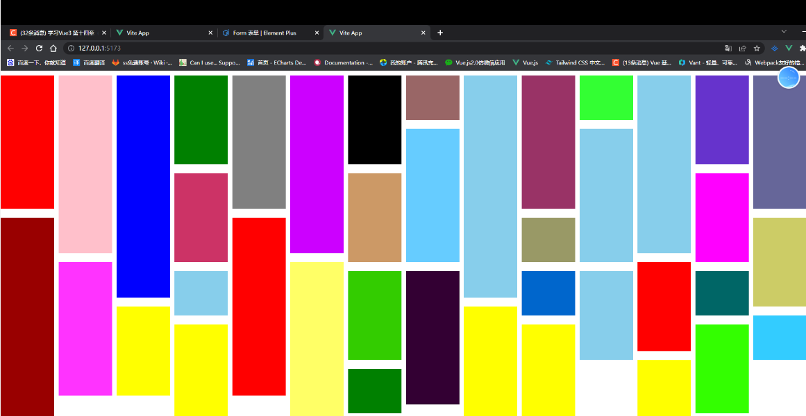

父组件通过 `v-bind` 绑定一个数据，然后子组件通过 `defineProps` 接受传过来的值，

子组件给父组件传参，是通过 `defineEmits` 派发一个事件

子组件还可以暴露方法给父组件，通过 `defineExpose`

# 父组件传参

父组件通过 `v-bind` 绑定一个数据，然后子组件通过 `defineProps` 接受传过来的值，

如以下代码

给 Menu 组件 传递了一个 title 字符串类型是不需要 v-bind

```vue
<template>
    <div class="layout">
        <Menu  title="我是标题"></Menu>
        <div class="layout-right">
            <Header></Header>
            <Content></Content>
        </div>
    </div>
</template>
```

传递非字符串类型需要加 v-bind  简写 冒号`:`

```vue
<template>
    <div class="layout">
        <Menu v-bind:data="data"  title="我是标题"></Menu>
        <div class="layout-right">
            <Header></Header>
            <Content></Content>
        </div>
    </div>
</template>

<script setup lang="ts">
import Menu from './Menu/index.vue'
import Header from './Header/index.vue'
import Content from './Content/index.vue'
import { reactive } from 'vue';

const data = reactive<number[]>([1, 2, 3])
</script>
```

## 子组件接受值

通过 defineProps   来接受  **defineProps 是无须引入的直接使用即可**

如果我们使用的 TypeScript

可以使用传递 `字面量类型` 的纯类型语法做为 参数
如 这是 TS 特有的

```vue
<template>
    <div class="menu">
        菜单区域 {{ title }}
        <div>{{ data }}</div>
    </div>
</template>

<script setup lang="ts">
defineProps<{
    title:string,
    data:number[]
}>()

//设置默认值，withDefaults() TS特有的函数
withDefaults(defineProps<{
title: string
}>(), {
title: () => "小满" //引用类型要传递 函数
})
</script>
```

如果你使用的不是 TS

```js
//接受父组件传过来的值 defineProps
const props = defineProps({
    title:{
        default:"", //设置默认值
        type:string
    },
    data:Array
})
//控制台输出，template输出 {{title}}
console.log(props.title)
```

# 子组件给父组件传参

是通过 defineEmits 派发一个事件

```vue
<template>
    <div class="menu">
        <button @click="clickTap">派发给父组件</button>
    </div>
</template>

<script setup lang="ts">
import { reactive } from 'vue'
const list = reactive<number[]>([4, 5, 6])

const emit = defineEmits(['on-click'])

//如果用了ts可以这样两种方式
// const emit = defineEmits<{
//     (e: "on-click", name: string): void
// }>()
const clickTap = () => {
    emit('on-click', list)
}

</script>
```

我们在子组件绑定了一个 click 事件 然后通过 defineEmits 注册了一个自定义事件

点击 click 触发 emit 去调用我们注册的事件 然后传递参数

## 父组件接受子组件的事件

```vue
<template>
    <div class="layout">
        <Menu @on-click="getList"></Menu>
        <div class="layout-right">
            <Header></Header>
            <Content></Content>
        </div>
    </div>
</template>

<script setup lang="ts">
import Menu from './Menu/index.vue'
import Header from './Header/index.vue'
import Content from './Content/index.vue'
import { reactive } from 'vue';

const data = reactive<number[]>([1, 2, 3])

const getList = (list: number[]) => {
    console.log(list,'父组件接受子组件');
}
</script>
```

我们从 Menu 组件接受子组件派发的事件 on-click 后面是我们自己定义的函数名称 getList

会把参数返回过来

## 子组件暴露给父组件内部属性

通过 `defineExpose`

我们从父组件获取子组件实例通过 ref

```vue
<Menu ref="menus"></Menu>
//这样获取是有代码提示的
const menus = ref<InstanceType<typeof menus>>()
```

然后打印 `menus.value` 发现没有任何属性

这时候父组件想要读到子组件的属性可以通过  `defineExpose` 暴露

```ts
const list = reactive<number[]>([4, 5, 6])

defineExpose({
    list
})
```

这样父组件就可以读到了


# 案例封装瀑布流组件

根据浏览器宽度计算 瀑布列数
每次在最短的图片高度下面添加图片，尽量追求每列最后一张图片 长度相差不多

实现原理：
1，确定列数，并排满第一列，同时每一列的当前记录到heightList中，此时heightList的长度已经固定，只需要每次都更改高度就可以了；


父组件

```vue
<template>
    <waterFallVue :list="list"></waterFallVue>
</template>

<script setup lang='ts'>
import { ref, reactive } from 'vue'
import waterFallVue from './components/water-fall.vue';
const list = [
    {
        height: 300,
        background: 'red'
    },
    {
        height: 400,
        background: 'pink'
    },
    {
        height: 500,
        background: 'blue'
    },
    {
        height: 200,
        background: 'green'
    },
    {
        height: 300,
        background: 'gray'
    },
    {
        height: 400,
        background: '#CC00FF'
    },
    {
        height: 200,
        background: 'black'
    },
    {
        height: 100,
        background: '#996666'
    },
    {
        height: 500,
        background: 'skyblue'
    },
    {
        height: 300,
        background: '#993366'
    },
    {
        height: 100,
        background: '#33FF33'
    },
    {
        height: 400,
        background: 'skyblue'
    },
    {
        height: 200,
        background: '#6633CC'
    },
    {
        height: 300,
        background: '#666699'
    },
    {
        height: 300,
        background: '#66CCFF'
    },
    {
        height: 300,
        background: 'skyblue'
    },
    {
        height: 200,
        background: '#CC3366'
    },
    {
        height: 200,
        background: '#CC9966'
    },
    {
        height: 200,
        background: '#FF00FF'
    },
    {
        height: 500,
        background: '#990000'
    },
    {
        height: 400,
        background: 'red'
    },
    {
        height: 100,
        background: '#999966'
    },
    {
        height: 200,
        background: '#CCCC66'
    },
    {
        height: 300,
        background: '#FF33FF'
    },
    {
        height: 400,
        background: '#FFFF66'
    },
    {
        height: 200,
        background: 'red'
    },
    {
        height: 100,
        background: 'skyblue'
    },
    {
        height: 200,
        background: '#33CC00'
    },
    {
        height: 300,
        background: '#330033'
    },
    {
        height: 100,
        background: '#0066CC'
    },
    {
        height: 200,
        background: 'skyblue'
    },
    {
        height: 100,
        background: '#006666'
    },
    {
        height: 200,
        background: 'yellow'
    },
    {
        height: 300,
        background: 'yellow'
    },
    {
        height: 100,
        background: '#33CCFF'
    },
    {
        height: 400,
        background: 'yellow'
    },
    {
        height: 400,
        background: 'yellow'
    },
    {
        height: 200,
        background: '#33FF00'
    },
    {
        height: 300,
        background: 'yellow'
    },
    {
        height: 100,
        background: 'green'
    }

]
</script>

<style  lang='less'>
#app,
html,
body {
    height: 100%;
}

* {
    padding: 0;
    margin: 0;
}
</style>
```

子组件

```vue
<template>
  <div class="wraps">
    <div :style="{height:item.height+'px',background:item.background,top:item.top+'px',left:item.left + 'px'}"
      v-for="item in waterList" class="items"></div>
  </div>
</template>

<script setup lang='ts'>
import { ref, reactive, onMounted } from 'vue'
const props = defineProps<{
  list: any[]
}>()
const waterList = reactive<any[]>([])
const init = () => {
  const heightList: any[] = [] //维护每一列添加图片后的高度
  const width = 130; //图片是120，预留一些宽度
  const x = document.body.clientWidth //获取浏览器的宽度
  const column = Math.floor(x / width) //计算列数

  for (let i = 0; i < props.list.length; i++) {
    if (i < column) { //计算第一列图片摆放的位置
      props.list[i].top = 10; //采用的是绝对位置布局
      props.list[i].left = i * width;
      heightList.push(props.list[i].height + 10) //保存为数组
      waterList.push(props.list[i])
    } else {
      let current = heightList[0]
      let index = 0;
      heightList.forEach((h, inx) => { //找到最短的一列，将图片添加到该列
        if (current > h) {
          current = h;
          index = inx;
        }
      })
      console.log(current, 'c')
      props.list[i].top = (current + 20); //current 就是最短一列的高度
      console.log(props.list[i].top, 'top', i)
      props.list[i].left = index * width;
      heightList[index] = (heightList[index] + props.list[i].height + 20);
      waterList.push(props.list[i])

    }
  }
  console.log(props.list)
}

onMounted(() => {
  window.onresize = () => init()
  init()
})

</script>

<style scoped lang='less'>
.wraps {
  position: relative;
  height: 100%;

  .items {
    position: absolute;
    width: 120px;
  }
}
</style>
```

