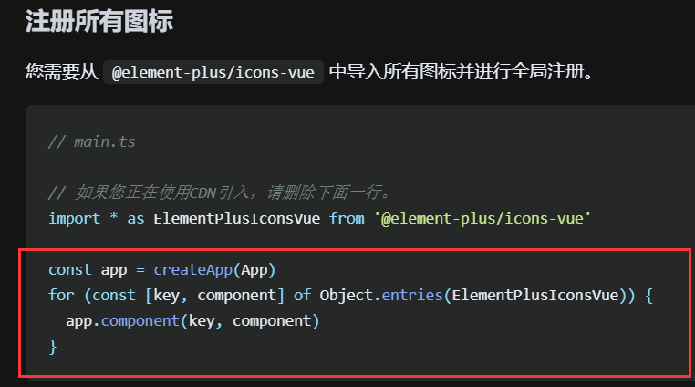
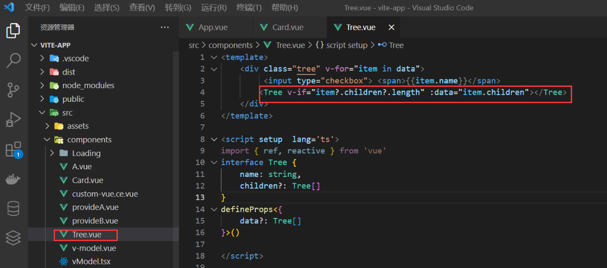
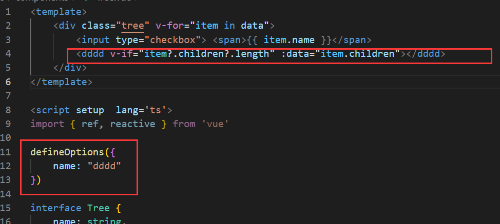

# 配置全局组件

例如组件使用频率非常高（table，Input，button，等）这些组件 几乎每个页面都在使用便可以封装成 **全局组件**

案例------我这儿封装一个 Card 组件想在任何地方去使用

```vue
<template>
  <div class="card">
     <div class="card-header">
         <div>标题</div>
         <div>副标题</div>
     </div>
     <div v-if='content' class="card-content">
         {{content}}
     </div>
  </div>
</template>

<script setup lang="ts">
type Props = {
    content:string
}
defineProps<Props>()

</script>

<style scoped lang='less'>
@border:#ccc;
.card{
    width: 300px;
    border: 1px solid @border;
    border-radius: 3px;
    &:hover{
        box-shadow:0 0 10px @border;
    }

    &-content{
        padding: 10px;
    }
    &-header{
        display: flex;
        justify-content: space-between;
        padding: 10px;
        border-bottom: 1px solid @border;
    }
}
</style>
```

使用方法

==在 `main.ts` 引入我们的组件跟随在 `createApp(App)` 后面 切记不能放到 `mount` 后面这是一个链式调用用==

其次调用  `component` 第一个参数 组件名称（自定义标签名） 第二个参数 组件实例（导入的组件）

```ts
import { createApp } from 'vue'
import App from './App.vue'
import './assets/css/reset/index.less'
import Card from './components/Card/index.vue'

//三步合一步了
createApp(App).component('Card',Card).mount('#app')
```

## 批量注册全局组件

可以参考 element ui 其实就是遍历一下然后通过 app.component 注册



# 配置局部组件

```vue
<template>
  <div class="wraps">
    <layout-menu :flag="flag" @on-click="getMenu" @on-toogle="getMenuItem" :data="menuList" class="wraps-left"></layout-menu>
    <div class="wraps-right">
      <layout-header> </layout-header>
      <layout-main class="wraps-right-main"></layout-main>
    </div>
  </div>
</template>

<script setup lang="ts">
import { reactive,ref } from "vue";
import layoutHeader from "./Header.vue";
import layoutMenu from "./Menu.vue";
import layoutMain from "./Content.vue";
```

就是在一个组件内（A） 通过 import 去引入别的组件(B) 称之为**局部组件**

应为 B 组件只能在 A 组件内使用 所以是局部组件

如果 C 组件想用 B 组件 就需要 C 组件也手动 import 引入 B 组件

# 配置递归组件

原理跟我们写 js 递归是一样的 自己调用自己 通过一个条件来结束递归 否则导致内存泄漏

## 案例递归树

在父组件配置数据结构 数组对象格式 传给子组件

```ts
type TreeList = {
  name: string;
  icon?: string;
  children?: TreeList[] | [];
};
const data = reactive<TreeList[]>([
  {
    name: "no.1",
    children: [
      {
        name: "no.1-1",
        children: [
          {
            name: "no.1-1-1",
          },
        ],
      },
    ],
  },
  {
    name: "no.2",
    children: [
      {
        name: "no.2-1",
      },
    ],
  },
  {
    name: "no.3",
  },
]);
```

子组件接收值 第一个 script

```ts
type TreeList = {
  name: string;
  icon?: string;
  children?: TreeList[] | [];
};

type Props<T> = {
  data?: T[] | [];
};

defineProps<Props<TreeList>>();

const clickItem = (item: TreeList) => {
  console.log(item)
}
```

---

# 子组件增加一个 script 定义组件名称为了 递归用  

给我们的组件定义名称有好几种方式

### 1.在增加一个 script 通过 export 添加 name

```vue
<script lang="ts">
export default {
  name:"TreeItem"
}
</script>
```

### 2.直接使用文件名当组件名



### 3.使用插件

[unplugin-vue-macros/README-zh-CN.md at sxzz/unplugin-vue-macros · GitHub](https://github.com/sxzz/unplugin-vue-macros/blob/HEAD/packages/define-options/README-zh-CN.md "unplugin-vue-macros/README-zh-CN.md at 722a80795a6c7558debf7c62fd5f57de70e0d0bf · sxzz/unplugin-vue-macros · GitHub")

`unplugin-vue-define-options`

```ts
import DefineOptions from 'unplugin-vue-define-options/vite'
import Vue from '@vitejs/plugin-vue'

export default defineConfig({
  plugins: [Vue(), DefineOptions()],
})
```

ts 支持

```js
"types": ["unplugin-vue-define-options/macros-global"],
```



## template 

TreeItem 其实就是当前组件 通过 import 把自身又引入了一遍 如果他没有 children 了就结束

```vue
   <div style="margin-left:10px;" class="tree">
    <div :key="index" v-for="(item,index) in data">
      <div @click='clickItem(item,$event)'>{{item.name}}
    </div>
    <TreeItem @on-click='clickItem' v-if='item?.children?.length' :data="item.children"></TreeItem>
  </div>
  </div>
```

注意，使用 `@click.stop` 阻止冒泡事件，不然深层递归连锁触发

### 触发事件
`@click='clickItem(item,$event)'` 
```ts
const clickItem = (item: TreeList) => {
  console.log(e.target)
}
```