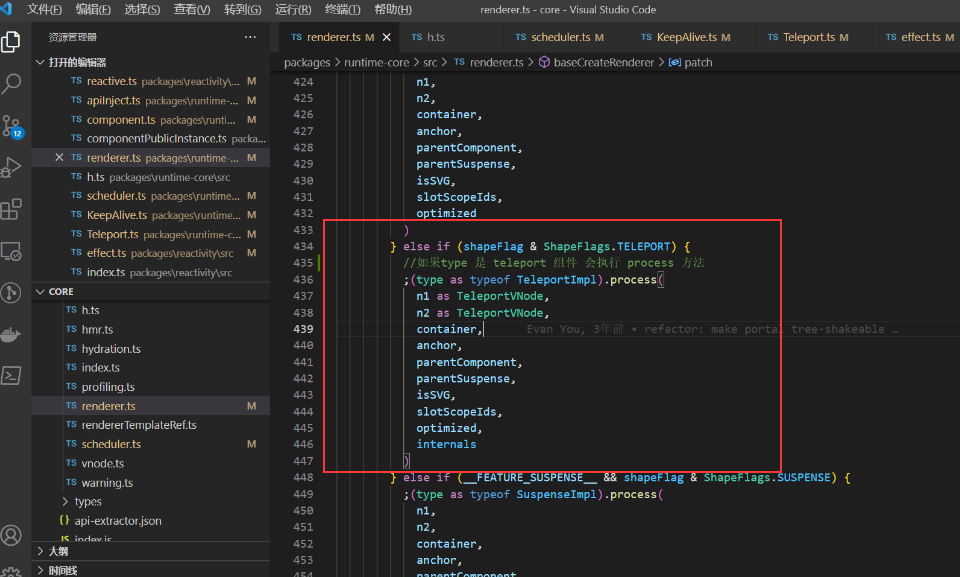
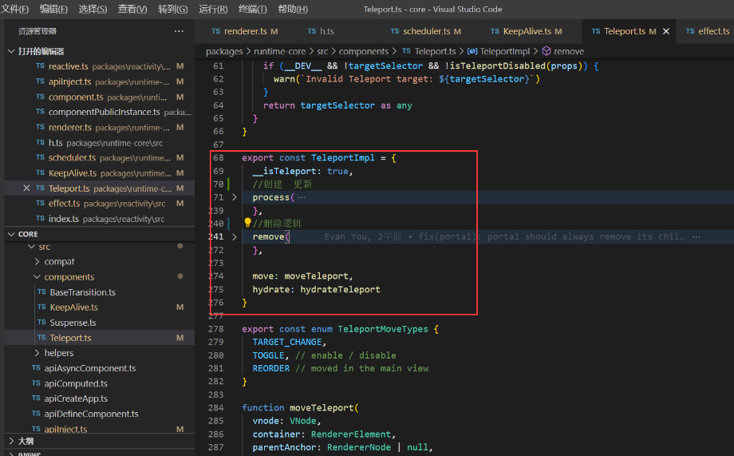
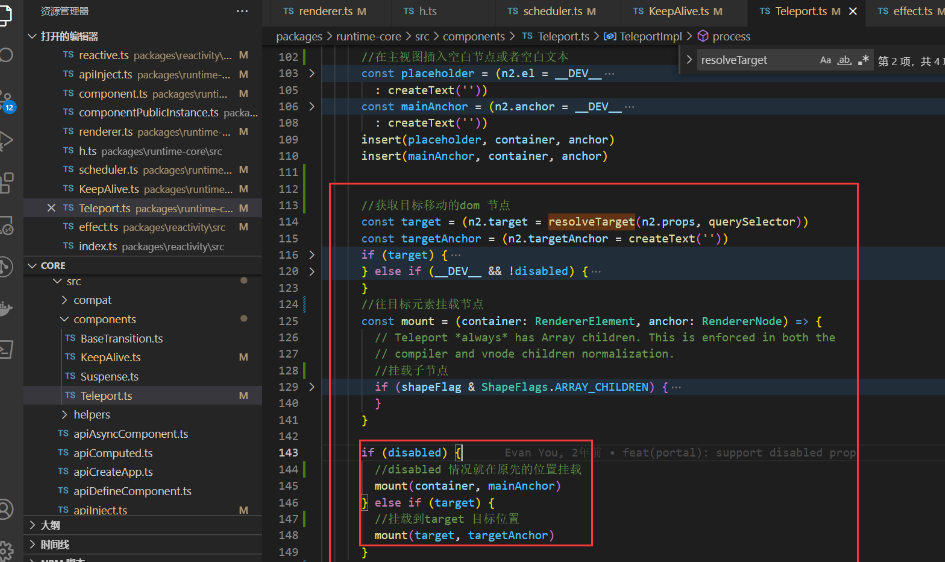
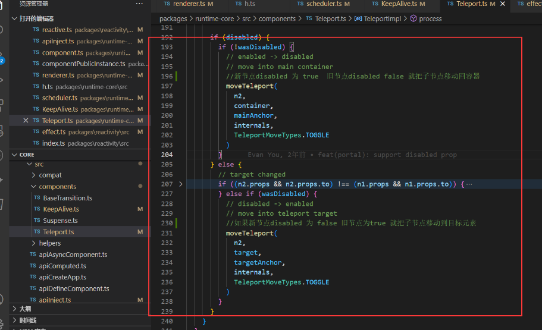
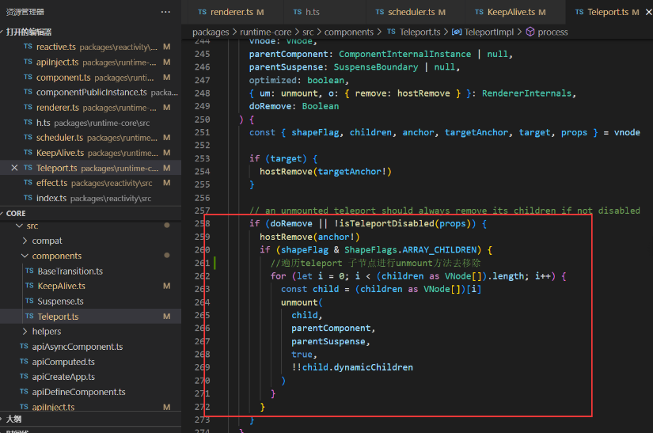

Teleport Vue 3.0 新特性之一。

Teleport 是一种能够将我们的模板渲染至指定 DOM 节点，不受父级 style、v-show 等属性影响，但 data、prop 数据依旧能够共用的技术；类似于 React 的 Portal。

主要解决的问题 因为 Teleport 节点挂载在其他指定的 DOM 节点下，完全不受父级 style 样式影响

## 使用方法

通过 to 属性 插入指定元素位置 to="body" 便可以将 Teleport 内容传送到指定位置

```vue
<Teleport to="body">
    <Loading></Loading>
</Teleport>
```

也可以自定义传送位置 支持 class id 等 选择器

```html
    <div id="app"></div>
    <div class="modal"></div>
```

### 事例

```vue
<template>

    <div class="dialog">
        <header class="header">
            <div>我是弹框</div>
            <el-icon>
                <CloseBold />
            </el-icon>
        </header>
        <main class="main">
            我是内容12321321321
        </main>
        <footer class="footer">
            <el-button size="small">取消</el-button>
            <el-button size="small" type="primary">确定</el-button>
        </footer>
    </div>

</template>

<script setup lang='ts'>
import { ref, reactive } from 'vue'

</script>
<style lang="less" scoped>
.dialog {
    width: 400px;
    height: 400px;
    background: #141414;
    display: flex;
    flex-direction: column;
    position: absolute;
    left: 50%;
    top: 50%;
    margin-left: -200px;
    margin-top: -200px;

    .header {
        display: flex;
        color: #CFD3DC;
        border-bottom: 1px solid #636466;
        padding: 10px;
        justify-content: space-between;
    }

    .main {
        flex: 1;
        color: #CFD3DC;
        padding: 10px;
    }

    .footer {
        border-top: 1px solid #636466;
        padding: 10px;
        display: flex;
        justify-content: flex-end;
    }
}
</style>
```

### 多个使用场景

```vue
<Teleport to=".modal1">
     <Loading></Loading>
</Teleport>
<Teleport to=".modal2">
     <Loading></Loading>
</Teleport>
```

### 动态控制 teleport

使用 disabled 设置为 true 则 to 属性不生效   false 则生效

```vue
    <teleport :disabled="true" to='body'>
      <A></A>
    </teleport>
```

### 源码解析

在创建 teleport 组件的时候会经过 patch 方法 然后调用 teleport 的 process 方法


主要是创建 更新   和删除的逻辑



他通过  resolveTarget  函数 获取了 props.to 和 querySelect 获取 了目标元素
然后判断是否有 disabled 如果有则 to 属性不生效 否则 挂载新的位置



新节点 disabled 为 true   旧节点 disabled false 就把子节点移动回容器

如果新节点 disabled 为 false 旧节点为 true 就把子节点移动到目标元素



遍历 teleport 子节点进行 unmount 方法去移除

