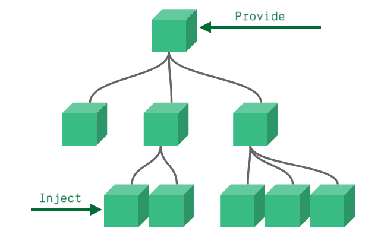
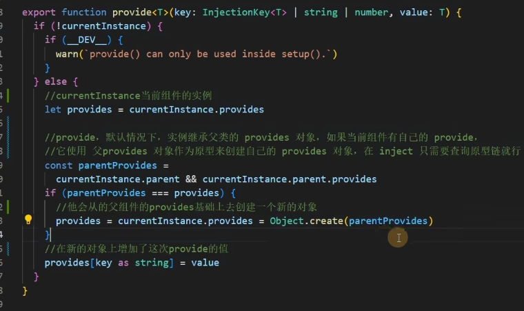

## Provide / Inject

通常，当我们需要从父组件向子组件传递数据时，我们使用 props。想象一下这样的结构：有一些深度嵌套的组件，而深层的子组件只需要父组件的部分内容。在这种情况下，如果仍然将 prop 沿着组件链逐级传递下去，可能会很麻烦。

官网的解释很让人疑惑，那我翻译下这几句话：

provide 可以在祖先组件中指定我们想要提供给后代组件的数据或方法，而在任何后代组件中，我们都可以使用 inject 来接收 provide 提供的数据或方法。



后代组件组件可以修改值，祖先组件也会被修改，如果祖先组件不想被修改，
用 `readonly()` 包裹

```ts
provide('flag', readonly(flag))
```

## 看一个例子

父组件传递数据

```vue
<template>
    <div class="App">
        <button>我是App</button>
        <A></A>
    </div>
</template>

<script setup lang='ts'>
import { provide, ref } from 'vue'
import A from './components/A.vue'
let flag = ref<number>(1)
provide('flag', flag)
</script>

<style>
.App {
    background: blue;
    color: #fff;
}
</style>
```

子组件接受

```vue
<template>
    <div style="background-color: green;">
        我是B
        <button @click="change">change falg</button>
        <div>{{ flag }}</div>
    </div>
</template>

<script setup lang='ts'>
import { inject, Ref, ref } from 'vue'

const flag = inject<Ref<number>>('flag', ref(1))

const change = () => {
    flag.value = 2
}
</script>

<style>
</style>
```

==TIPS 你如果传递普通的值 是不具有响应式的 需要通过 ref reactive 添加响应式==

## 使用场景

当父组件有很多数据需要分发给其子代组件的时候， 就可以使用 provide 和 inject。

## 源码解析




用原型链的方式，继承父组件
```ts
var a = {name:1}
var b = Object.create(a) //通过继承的方式
b //{}
b.name //1
```