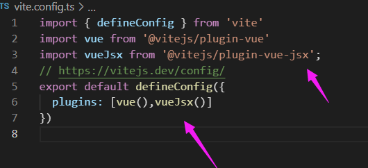
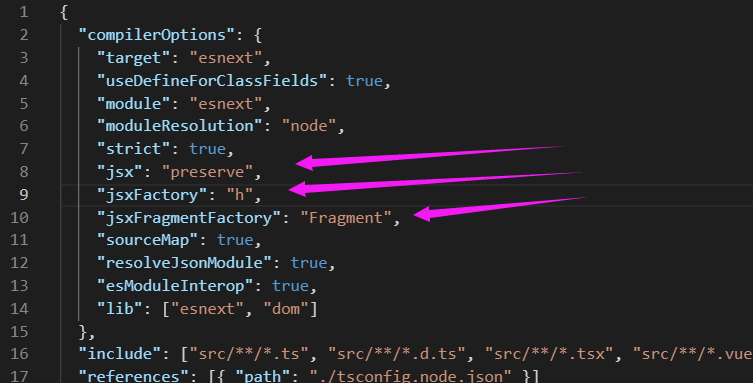
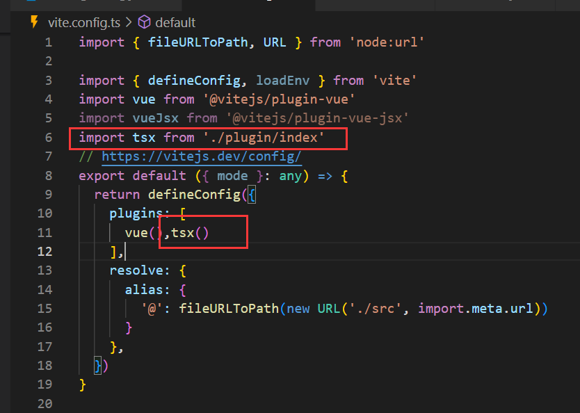
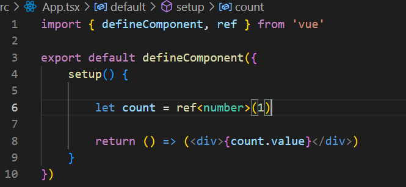
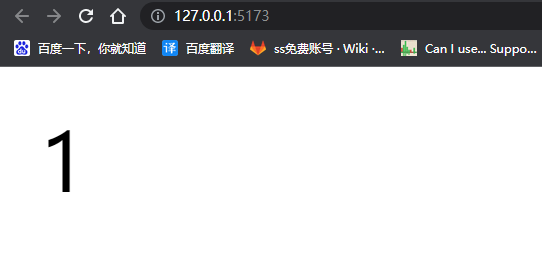

**完整版用法** 请看  [@vue/babel-plugin-jsx - npm](https://www.npmjs.com/package/@vue/babel-plugin-jsx "@vue/babel-plugin-jsx - npm")

我们之前呢是使用 Template 去写我们模板。现在可以扩展另一种风格 TSX 风格

vue2 的时候就已经支持 jsx 写法，只不过不是很友好，随着 vue3 对 typescript 的支持度，tsx 写法越来越被接受

## 1.安装插件

`npm install @vitejs/plugin-vue-jsx -D`

`vite.config.ts` 配置


```ts
import { defineConfig } from 'vite'
import vue from '@vitejs/plugin-vue'
import vueJsx from '@vitejs/plugin-vue-jsx';
// https://vitejs.dev/config/
export default defineConfig({
  plugins: [vue(),vueJsx()]
})
```

## 2.修改 tsconfig.json 配置文件

```json
"jsx": "preserve",
"jsxFactory": "h",
"jsxFragmentFactory": "Fragment",
```



配置完成就可以使用啦

在目录新建一个 xxxxxx.tsx 文件

## 3.使用 TSX

### 方法一 返回一个渲染函数

```ts
export default function () {
    return (<div>小满</div>)
}
```

### 方法二 optionsAPI

```ts
import { defineComponent } from "vue";
export default defineComponent({
    data() {
    return {
        age: 23
        }
    }, render() {
    return (<div>{this.age}</div>)
   }
})
```

### 方法三 setup 函数模式

```ts
import { defineComponent } from "vue";
export default defineComponent({
  setup(props, ctx) {
      return ()=>(<div>小满setup</div>)
  },
})
```

# tsx 与 template 不同

Tips:

-   ==tsx 不会自动解包使用 ref 加.vlaue ! ! !==
-   v-if 不支持 三元表达式去代替
-   map 去代替 v-for
-   v-bind {}代替
-   props emit

## tsx 支持 v-model 的使用

```ts

import { ref } from 'vue'

let v = ref<string>('')

const renderDom = () => {
    return (
        <>
           <input v-model={v.value} type="text" />
           <div>
               {v.value}
           </div>
        </>
    )
}

export default renderDom
```

## v-show

```ts

import { ref } from 'vue'

let flag = ref(false)

const renderDom = () => {
    return (
        <>
           <div v-show={flag.value}>景天</div>
           <div v-show={!flag.value}>雪见</div>
        </>
    )
}

export default renderDom
```

## v-if 是不支持的

```ts
import { ref } from 'vue'

let flag = ref(false)

const renderDom = () => {
    return (
        <>
            {
                flag.value ? <div>景天</div> : <div>雪见</div>
            }
        </>
    )
}

export default renderDom
```

## v-for 也是不支持的

需要使用 Map

```ts
import { ref } from 'vue'

let arr = [1,2,3,4,5]

const renderDom = () => {
    return (
        <>
            {
              arr.map(v=>{
                  return <div>${v}</div>
              })
            }
        </>
    )
}

export default renderDom
```

## v-bind 使用

直接赋值就可以

```ts
import { ref } from 'vue'

let arr = [1, 2, 3, 4, 5]

const renderDom = () => {
    return (
        <>
            <div data-arr={arr}>1</div>
        </>
    )
}

export default renderDom
```

## v-on 绑定事件   所有的事件都按照 react 风格来

-   所有事件有 on 开头
-   所有事件名称首字母大写

```ts

const renderDom = () => {
    return (
        <>
            <button onClick={clickTap}>点击</button>
        </>
    )
}

const clickTap = () => {
    console.log('click');
}

export default renderDom
```

## Props 接受值

```ts

import { ref } from 'vue'

type Props = {
    title:string
}

const renderDom = (props:Props) => {
    return (
        <>
            <div>{props.title}</div>
            <button onClick={clickTap}>点击</button>
        </>
    )
}

const clickTap = () => {
    console.log('click');
}

export default renderDom
```

App.vue
```vue
<template>
<div>
    <xiaoman title="小满props"></xiaoman>
</div>
</template>

```

## Emit 派发

```ts
type Props = {
    title: string
}

const renderDom = (props: Props,content:any) => {
    return (
        <>
            <div>{props.title}</div>
            <button onClick={clickTap.bind(this,content)}>点击</button>
        </>
    )
}

const clickTap = (ctx:any) => {

    ctx.emit('on-click',1)
}
```

## Slot

```ts
const A = (props, { slots }) => (
  <>
    <h1>{ slots.default ? slots.default() : 'foo' }</h1>
    <h2>{ slots.bar?.() }</h2>
  </>
);

const App = {
  setup() {
    const slots = {
      bar: () => <span>B</span>,
    };
    return () => (
      <A v-slots={slots}>
        <div>A</div>
      </A>
    );
  },
};

// or

const App = {
  setup() {
    const slots = {
      default: () => <div>A</div>,
      bar: () => <span>B</span>,
    };
    return () => <A v-slots={slots} />;
  },
};

// or you can use object slots when `enableObjectSlots` is not false.
const App = {
  setup() {
    return () => (
      <>
        <A>
          {{
            default: () => <div>A</div>,
            bar: () => <span>B</span>,
          }}
        </A>
        <B>{() => "foo"}</B>
      </>
    );
  },
};
```

# 加餐实现一个 vite 插件解析 tsx

tsx的底层实现，就是利用 `babel` 做了一个语法转化


1.需要用到的第三方插件

```sh
npm install @vue/babel-plugin-jsx
npm install @babel/core
npm install @babel/plugin-transform-typescript
npm install @babel/plugin-syntax-import-meta
npm install @types/babel__core
```

插件代码

```ts
import type { Plugin } from 'vite'
import * as babel from '@babel/core'; //@babel/core核心功能：将源代码转成目标代码。
import jsx from '@vue/babel-plugin-jsx'; //Vue给babel写的插件支持tsx v-model等
export default function (): Plugin {
    return {
        name: "vite-plugin-tsx",
        config (config) {
           return {
              esbuild:{
                 include:/\.ts$/
              }
           }
        },
        async transform(code, id) {
            if (/.tsx$/.test(id)) {
                //@ts-ignore
                const ts = await import('@babel/plugin-transform-typescript').then(r=>r.default)
                const res = babel.transformSync(code,{
                    plugins:[jsx,[ts, { isTSX: true, allowExtensions: true }]], //添加babel插件
                    ast:true, // ast: 抽象语法树，源代码语法结构的一种抽象表示。babel内部就是通过操纵ast做到语法转换。
                    babelrc:false, //.babelrc.json
                    configFile:false //默认搜索默认babel.config.json文件
                })
                return res?.code //code: 编译后的代码
            }

            return code
        }
    }
}
```





