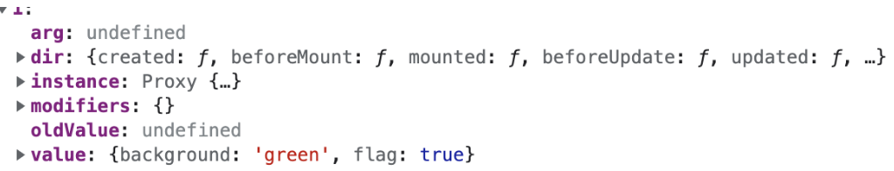

**directive-自定义指令（属于破坏性更新）**

Vue 中有 `v-if`,`v-for`,`v-bind`,`v-show`,`v-model` 等等一系列方便快捷的指令 今天一起来了解一下 vue 里提供的自定义指令

## 1.Vue3 指令的钩子函数

- `created` 元素初始化的时候
- `beforeMount` 指令绑定到元素后调用 只调用一次
- `mounted` 元素插入父级 dom 调用
- `beforeUpdate` 元素被更新之前调用
- `update` 这个周期方法被移除 改用 `updated`
- `beforeUnmount` 在元素被移除前调用
- `unmounted` 指令被移除后调用 只调用一次

Vue2 指令 bind inserted update componentUpdated unbind

## 2.在 setup 内定义局部指令

但这里有一个需要注意的限制：必须以 `vNameOfDirective` 的形式来命名本地自定义指令，以使得它们可以直接在模板中使用。
```vue
<template>
  <button @click="show = !show">开关{{show}} ----- {{title}}</button>
  <Dialog  v-move-directive="{background:'green',flag:show}"></Dialog>
</template>
```

```ts
 
const vMoveDirective: Directive = {
  created: () => {
    console.log("初始化====>");
  },
  beforeMount(...args: Array<any>) {
    // 在元素上做些操作
    console.log("初始化一次=======>");
  },
  mounted(el: any, dir: DirectiveBinding<Value>) {
    el.style.background = dir.value.background;
    console.log("初始化========>");
  },
  beforeUpdate() {
    console.log("更新之前");
  },
  updated() {
    console.log("更新结束");
  },
  beforeUnmount(...args: Array<any>) {
    console.log(args);
    console.log("======>卸载之前");
  },
  unmounted(...args: Array<any>) {
    console.log(args);
    console.log("======>卸载完成");
  },
};
```

## 3.生命周期钩子参数详解
第一个 el  当前绑定的DOM 元素

第二个 binding

- instance：使用指令的组件实例。
- value：传递给指令的值。例如，在 v-my-directive="1 + 1" 中，该值为 2。
- oldValue：先前的值，仅在 beforeUpdate 和 updated 中可用。无论值是否有更改都可用。
- arg：传递给指令的参数(如果有的话)。例如在 v-my-directive:foo 中，arg 为 "foo"。
- modifiers：包含修饰符(如果有的话) 的对象。例如在 v-my-directive.foo.bar 中，修饰符对象为 {foo: true，bar: true}。
- dir：一个对象，在注册指令时作为参数传递。例如，在以下指令中



第三个 当前元素的虚拟DOM 也就是Vnode

第四个 prevNode 上一个虚拟节点，仅在 `beforeUpdate` 和 `updated` 钩子中可用


## 4.函数简写

你可能想在 `mounted` 和 `updated` 时触发相同行为，而不关心其他的钩子函数。那么你可以通过将这个函数模式实现
```vue
<template>
   <div>
      <input v-model="value" type="text" />
      <A v-move="{ background: value }"></A>
   </div>
</template>
   
<script setup lang='ts'>
import A from './components/A.vue'
import { ref, Directive, DirectiveBinding } from 'vue'
let value = ref<string>('')
type Dir = {
   background: string
}
const vMove: Directive = (el, binding: DirectiveBinding<Dir>) => {
   el.style.background = binding.value.background
}
</script>
 
 
 
<style>
</style>
```

### 1.案例自定义拖拽指令

```vue
<template>
  <div v-move class="box">
    <div class="header"></div>
    <div>
      内容
    </div>
  </div>
</template>
 
<script setup lang='ts'>
import { Directive } from "vue";
const vMove: Directive = {
  mounted(el: HTMLElement) {
    let moveEl = el.firstElementChild as HTMLElement;
    const mouseDown = (e: MouseEvent) => {
      //鼠标点击物体那一刻相对于物体左侧边框的距离=点击时的位置相对于浏览器最左边的距离-物体左边框相对于浏览器最左边的距离
      console.log(e.clientX, e.clientY, "-----起始", el.offsetLeft);
      let X = e.clientX - el.offsetLeft;
      let Y = e.clientY - el.offsetTop;
      const move = (e: MouseEvent) => {
        el.style.left = e.clientX - X + "px";
        el.style.top = e.clientY - Y + "px";
        console.log(e.clientX, e.clientY, "---改变");
      };
      document.addEventListener("mousemove", move);
      document.addEventListener("mouseup", () => {
        document.removeEventListener("mousemove", move);
      });
    };
    moveEl.addEventListener("mousedown", mouseDown);
  },
};
</script>
 
<style lang='less'>
.box {
  position: fixed;
  left: 50%;
  top: 50%;
  transform: translate(-50%, -50%);
  width: 200px;
  height: 200px;
  border: 1px solid #ccc;
  .header {
    height: 20px;
    background: black;
    cursor: move;
  }
}
</style>
```

### 2.案例权限按钮

```vue
<template>
   <div class="btns">
       <button v-has-show="'shop:create'">创建</button>
 
       <button v-has-show="'shop:edit'">编辑</button>
 
       <button v-has-show="'shop:delete'">删除</button>
   </div>
</template>
 
<script setup lang='ts'>
import { ref, reactive,  } from 'vue'
import type {Directive} from 'vue'
//permission
localStorage.setItem('userId','xiaoman-zs')
 
//mock后台返回的数据
const permission = [
    'xiaoman-zs:shop:edit',
    'xiaoman-zs:shop:create',
    'xiaoman-zs:shop:delete'
]
const userId = localStorage.getItem('userId') as string
const vHasShow:Directive<HTMLElement,string> = (el,bingding) => {
   if(!permission.includes(userId+':'+ bingding.value)){
       el.style.display = 'none'
   }
}
 
</script>
 
<style scoped lang='less'>
.btns{
    button{
        margin: 10px;
    }
}
</style>
```