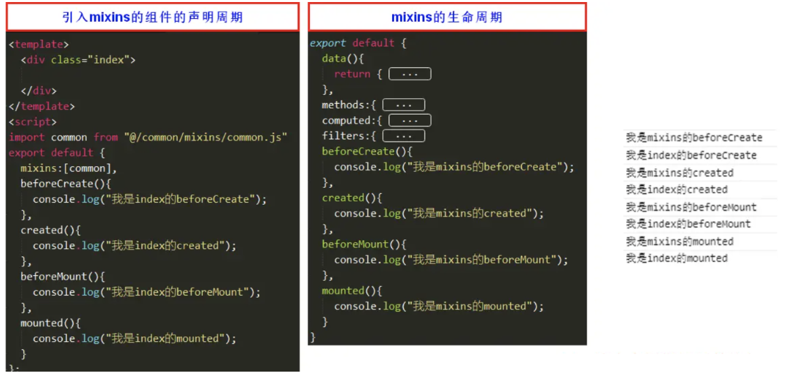

# Vue3 自定义 Hook

主要用来处理复用代码逻辑的一些封装

这个在 vue2 就已经有一个东西是 `Mixins`

mixins 就是将这些多个相同的逻辑抽离出来，各个组件只需要引入 `mixins`，就能实现一次写代码，多组件受益的效果。

弊端就是 会涉及到覆盖的问题

组件的 `data`、`methods`、`filters` 会覆盖 `mixins` 里的同名 `data`、`methods`、`filters`。



第二点就是 变量来源不明确（隐式传入），不利于阅读，使代码变得难以维护。

Vue3 的自定义的 hook

-   Vue3 的 hook 函数 相当于 vue2 的 mixin, 不同在与 hooks 是函数
-   Vue3 的 hook 函数 可以帮助我们提高代码的复用性, 让我们能在不同的组件中都利用 hooks 函数

Vue3 hook 库 [Get Started | VueUse](https://vueuse.org/guide/ "Get Started | VueUse")

## 案例

```ts
import { onMounted } from 'vue'


type Options = {
    el: string
}

type Return = {
    Baseurl: string | null
}
export default function (option: Options): Promise<Return> {

    return new Promise((resolve) => { //异步执行
        onMounted(() => {
            const file: HTMLImageElement = document.querySelector(option.el) as HTMLImageElement;
            file.onload = ():void => {
                resolve({
                    Baseurl: toBase64(file)
                })
            }

        })


        const toBase64 = (el: HTMLImageElement): string => {
            const canvas: HTMLCanvasElement = document.createElement('canvas')
            const ctx = canvas.getContext('2d') as CanvasRenderingContext2D
            canvas.width = el.width
            canvas.height = el.height
            ctx.drawImage(el, 0, 0, canvas.width,canvas.height)
            console.log(el.width);

            return canvas.toDataURL('image/png')

        }
    })


}
```