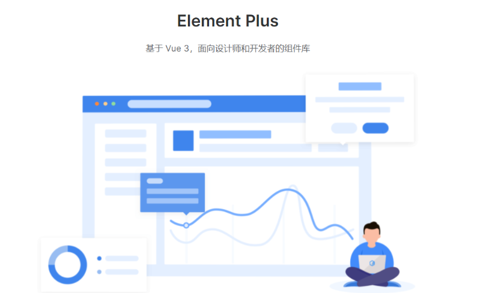
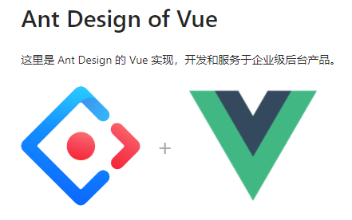
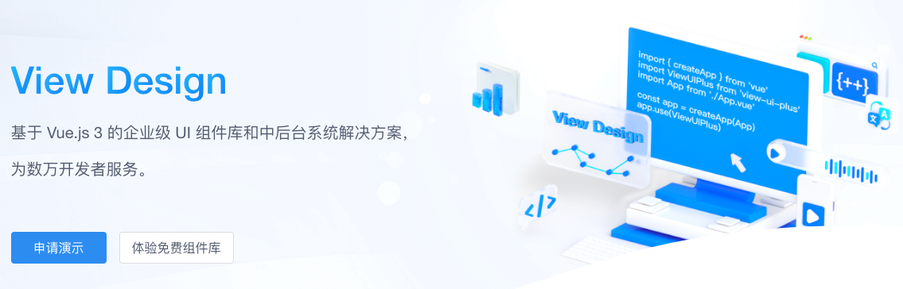
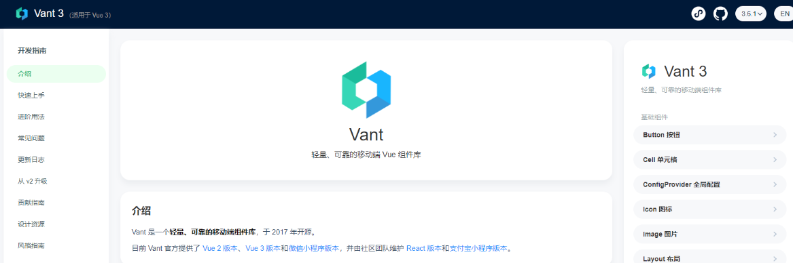

**vue**作为一款深受广大群众以及尤大崇拜者的喜欢，特此列出在 github 上开源的 vue 优秀的 UI 组件库供大家参考

这几套框架主要用于后台管理系统和移动端的制作，方便开发者快速开发

# Element UI Plus

TS+Setup语法糖

安装方法

```sh
# NPM
$ npm install element-plus --save

# Yarn
$ yarn add element-plus

# pnpm
$ pnpm install element-plus
```

main ts 引入

```ts
import { createApp } from 'vue'
import ElementPlus from 'element-plus'
import 'element-plus/dist/index.css'
import App from './App.vue'

const app = createApp(App)

app.use(ElementPlus)
app.mount('#app')
```

volar 插件支持

```json
{
  "compilerOptions": {
    // ...
    "types": ["element-plus/global"]
  }
}
```

[一个 Vue 3 UI 框架 | Element Plus](https://element-plus.gitee.io/zh-CN/ "一个 Vue 3 UI 框架 | Element Plus")


# Ant Design Vue

setup函数模式

安装

```sh
$ npm install ant-design-vue@next --save
$ yarn add ant-design-vue@next
```

使用

```ts
import { createApp } from 'vue';
import Antd from 'ant-design-vue';
import App from './App';
import 'ant-design-vue/dist/antd.css';

const app = createApp(App);

app.use(Antd).mount('#app');
```



[https://next.antdv.com/docs/vue/introduce-cn](https://next.antdv.com/docs/vue/introduce-cn "https://next.antdv.com/docs/vue/introduce-cn")

# 3.Iview 

vue2首选 optionAPI
安装

```sh
npm install view-ui-plus --save
```

使用

```ts
import { createApp } from 'vue'
import ViewUIPlus from 'view-ui-plus'
import App from './App.vue'
import router from './router'
import store from './store'
import 'view-ui-plus/dist/styles/viewuiplus.css'

const app = createApp(App)

app.use(store)
  .use(router)
  .use(ViewUIPlus)
  .mount('#app')
```



[https://www.iviewui.com](https://www.iviewui.com/)

# 4. Vant  移动端

安装

```sh
npm i vant -S
```

使用

```typescript
import Vant from 'vant'
import 'vant/lib/index.css';
createApp(App).use(vant).$mount('#app)
```



[Vant 3 - Lightweight Mobile UI Components built on Vue](https://vant-contrib.gitee.io/vant/#/zh-CN/home "Vant 3 - Lightweight Mobile UI Components built on Vue")