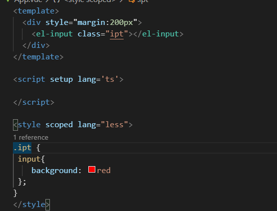
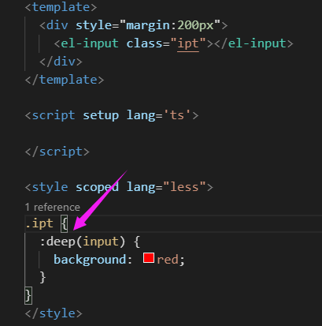
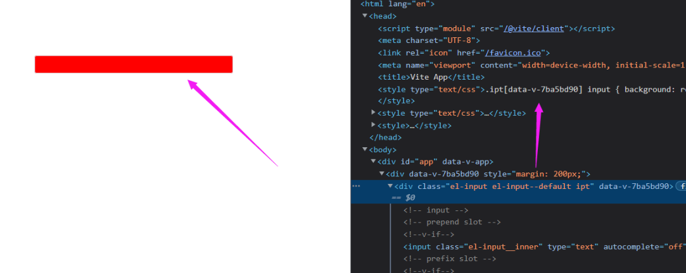
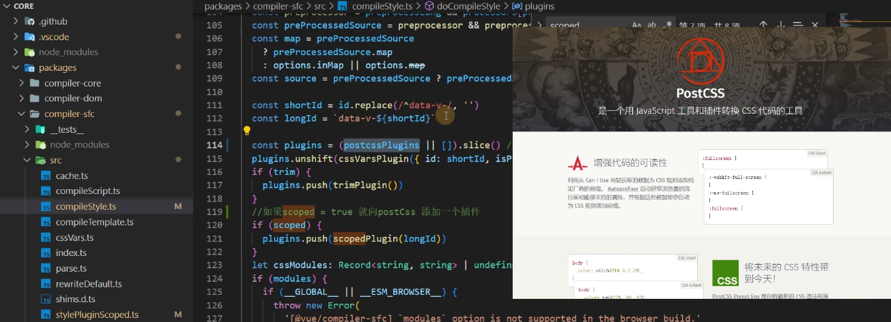
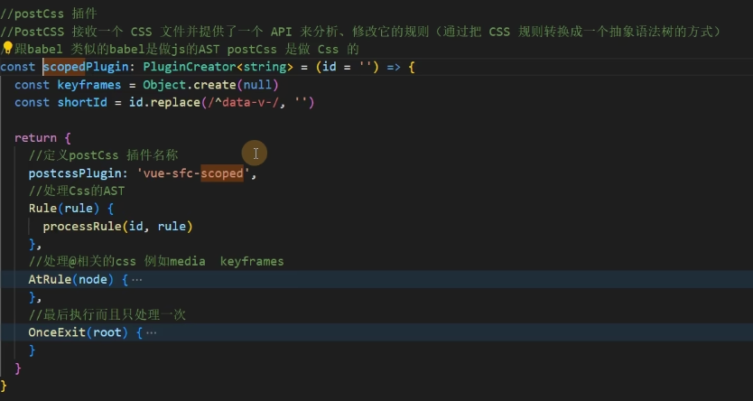

主要是用于修改很多 vue 常用的组件库（ [了解 UI 库 ElementUI，AntDesigin 等](31-了解UI库ElementUI，AntDesigin等.md) ），虽然配好了样式但是还是需要更改其他的样式

就需要用到样式穿透

# scoped 的原理

vue 中的 scoped 通过在 DOM 结构以及 css 样式上加唯一不重复的标记:data-v-hash 的方式，以保证唯一（而这个工作是由过 PostCSS 转译实现的），达到样式私有化模块化的目的。

总结一下 scoped 三条渲染规则：

-   给 HTML 的 DOM 节点加一个不重复 data 属性(形如：data-v-123)来表示他的唯一性
-   在每句 css 选择器的末尾（编译后的生成的 css 语句）加一个当前组件`.ipt`的 data 属性选择器（如`.ipt[data-v-123]`）来私有化样式
-   如果组件内部包含有其他组件，只会给其他组件的最外层标签加上当前组件的 data 属性

PostCSS 会给一个组件中的所有 dom 添加了一个独一无二的动态属性 data-v-xxxx，然后，给 CSS 选择器额外添加一个对应的属性选择器来选择该组件中 dom，这种做法使得样式只作用于含有该属性的 dom——组件内部 dom, 从而达到了'样式模块化'的效果.

案例修改 Element ui Input 样式

发现没有生效

如果不写 Scoped 就没问题

原因就是 Scoped 搞的鬼 他在进行 PostCss 转化的时候把元素选择器默认放在了最后

# 样式穿透

## :deep()

^e3f2d4

Vue3 提供了样式穿透 `:deep()` ，把类名放到括号里面，他的作用就是用来改变 属性选择器的位置(Vu2 `/deep/`)

相当于给 class 加了唯一 id

## 源码解析

检测到 scoped ，添加 `postCss` 插件

### postCss 插件

PostCSS 接收一个 CSS 文件并提供了一个 API 来分析、修改它的规则(通过把 CSS 规则转换成一个抽象语法树的方式)
跟 babel 类似的 babel 是做 js 的， AST postCss 是做 Css 的

