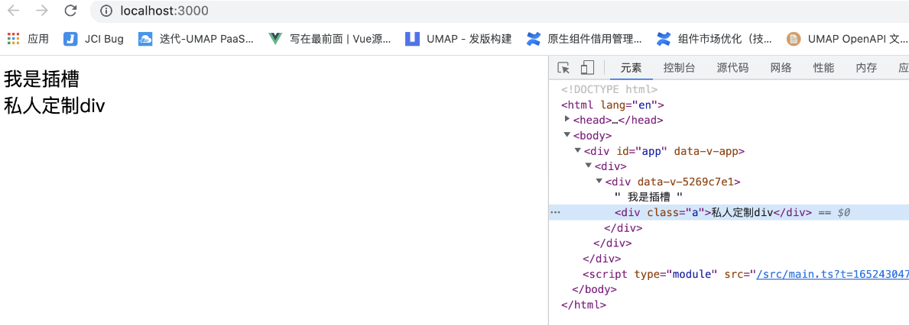
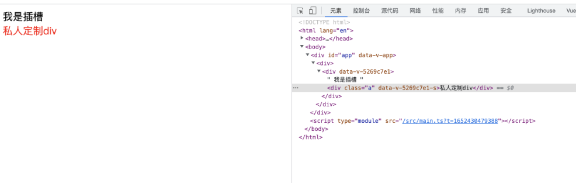

上一章已经讲过了 [:deep()](32-详解Scoped和样式穿透.md#^e3f2d4) ,其实还有两个选择器可以补充

### 1.插槽选择器

A 组件定义一个插槽

```vue
<template>
    <div>
        我是插槽
        <slot></slot>
    </div>
</template>

<script>
export default {}
</script>

<style scoped>

</style>
```

在 App.vue 引入

```vue
<template>
    <div>
        <A>
            <div class="a">私人定制div</div>
        </A>
    </div>
</template>

<script setup>
import A from "@/components/A.vue"
</script>


<style lang="less" scoped>
</style>
```

在 A 组件修改 class a 的颜色

```vue
<style scoped>
.a{
    color:red
}
</style>
```

无效果


情况下，作用域样式不会影响到  `<slot/>`  渲染出来的内容，因为它们被认为是父组件所持有并传递进来的。

解决方案   slotted

```vue
<style scoped>
 :slotted(.a) {
    color:red
}
</style>
```



###  2.全局选择器

在之前我们想加入全局 样式 通常都是新建一个 style 标签 不加 `scoped`  现在有更优雅的解决方案

```vue
<style>
 div{
     color:red
 }
</style>

<style lang="less" scoped>

</style>
```

```vue
<style lang="less" scoped>
:global(div){
    color:red
}
</style>
```

效果等同于上面

### 3.动态 CSS

单文件组件的  `<style>`  标签可以通过  `v-bind`  这一 CSS 函数将 CSS 的值关联到动态的组件状态上：

```vue
<template>
    <div class="div">
       小满是个弟弟
    </div>
</template>

<script lang="ts" setup>
import { ref } from 'vue'
const red = ref<string>('red')
</script>

<style lang="less" scoped>
.div{
   color:v-bind(red)
}

</style>
```

如果是对象  `v-bind` 请加引号

```vue
 <template>
    <div class="div">
        小满是个弟弟
    </div>
</template>

<script lang="ts" setup>
import { ref } from "vue"
const red = ref({
    color:'pink'
})
</script>

    <style lang="less" scoped>
.div {
    color: v-bind('red.color');
}
</style>
```

### 4.css `module`

`<style module>`  标签会被编译为  [CSS Modules](https://github.com/css-modules/css-modules "CSS Modules")  并且将生成的 CSS 类作为  `$style`  对象的键暴露给组件

```vue
<template>
    <div :class="$style.red">
        小满是个弟弟
    </div>
</template>

<style module>
.red {
    color: red;
    font-size: 20px;
}
</style>
```

自定义注入名称（多个可以用数组）

你可以通过给  `module` attribute 一个值来自定义注入的类对象的 property 键

```vue
<template>
    <div :class="[zs.red,zs.border]">
        小满是个弟弟
    </div>
</template>

<style module="zs">
.red {
    color: red;
    font-size: 20px;
}
.border{
    border: 1px solid #ccc;
}
</style>
```

与组合式 API 一同使用

注入的类可以通过 useCssModule API 在 setup() 和 `<script setup>` 中使用。对于使用了自定义注入名称的 `<style module>` 模块，useCssModule 接收一个对应的 module attribute 值作为第一个参数

```vue
<template>
    <div :class="[zs.red,zs.border]">
        小满是个弟弟
    </div>
</template>


<script setup lang="ts">
import { useCssModule } from 'vue'
const css = useCssModule('zs')
</script>

<style module="zs">
.red {
    color: red;
    font-size: 20px;
}
.border{
    border: 1px solid #ccc;
}
</style>
```

使用场景一般用于 `TSX` 和 `render`  函数 居多