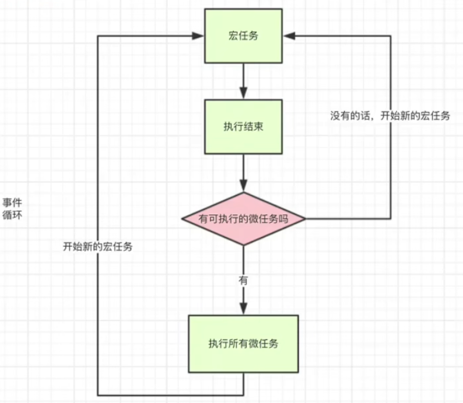
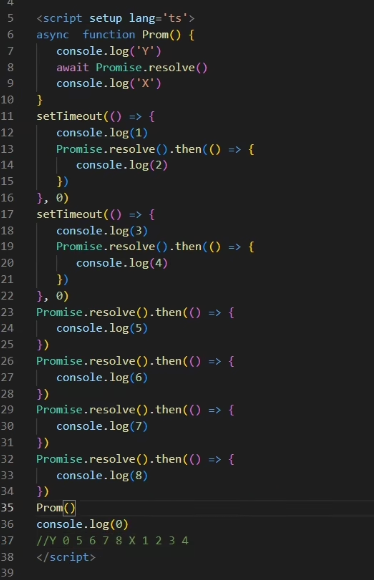

## JS 执行机制

在我们学 js 的时候都知道 js 是单线程的如果是多线程的话会引发一个问题在同一时间同时操作 DOM 一个增加一个删除 JS 就不知道到底要干嘛了，所以这个语言是单线程的但是随着 HTML5 到来 js 也支持了多线程 webWorker 但是也是不允许操作 DOM

单线程就意味着所有的任务都需要排队，后面的任务需要等前面的任务执行完才能执行，如果前面的任务耗时过长，后面的任务就需要一直等，一些从用户角度上不需要等待的任务就会一直等待，这个从体验角度上来讲是不可接受的，所以 JS 中就出现了异步的概念。

## 同步任务

代码从上到下按顺序执行

## 异步任务

### 1.宏任务

script(整体代码)、setTimeout、setInterval、UI 交互事件、postMessage、Ajax

### 2.微任务

`Promise.then`(Promise 构造函数是宏任务) `catch` `finally`、`MutaionObserver`、`process.nextTick`(Node.js 环境)

运行机制

所有的同步任务都是在主进程执行的形成一个执行栈，主线程之外，还存在一个"任务队列"，异步任务执行队列中先执行宏任务，然后清空当次宏任务中的所有微任务，然后进行下一个 tick 如此形成循环。

从上到下解析，1.两个setTimeout放到宏任务队列 2. 4个promise放到微任务队列 3.执行Prom，其中X放到微任务队列末尾。所以X在5 6 7 8后面