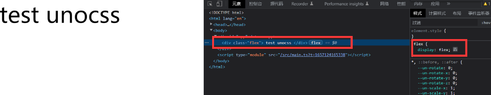
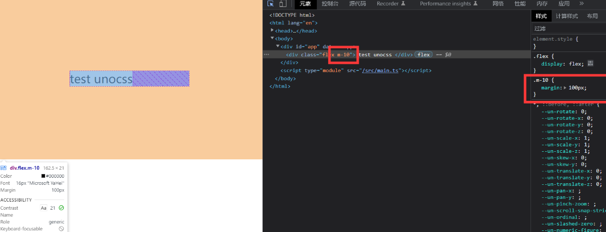
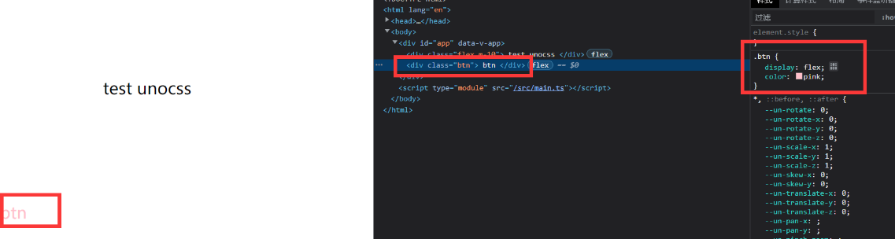
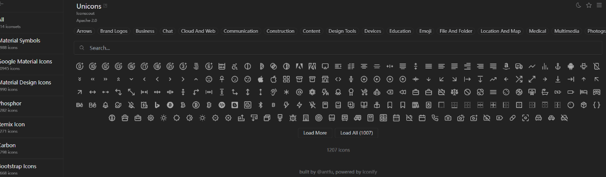
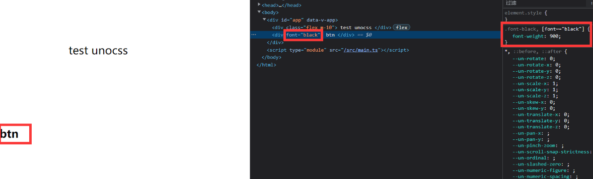

# 重新构想 原子化 CSS

[重新构想原子化 CSS - 知乎](https://zhuanlan.zhihu.com/p/425814828 "重新构想原子化CSS - 知乎")

## 什么是 css 原子化？

CSS 原子化的优缺点

1. 减少了 css 体积，提高了 css 复用
2. 减少起名的复杂度
3. 增加了记忆成本 将 css 拆分为原子之后，你势必要记住一些 class 才能书写，哪怕 tailwindcss 提供了完善的工具链，你写 background，也要记住开头是 bg

> [!NOTE]
> Tailwind 也能实现这样的拓展
> [34-Vue3集成Tailwind CSS](34-Vue3集成Tailwind-CSS.md) 

## 接入 unocss

tips：最好用于 vite webpack 属于阉割版功能很少

### 安装

```zsh
npm i -D unocss
```

vite.config.ts

```ts
import unocss from 'unocss/vite'
import { presetIcons, presetAttributify, presetUno } from 'unocss'

export default defineConfig({
  plugins: [vue(), vueJsx(), unocss({
    presets: [presetIcons(), presetAttributify(), presetUno()], //一些预设
    rules: [
      ['flex', { display: 'flex' }], //flex 相当于 display: 'flex' ，全局通用
      ['red', { color: 'red' }],
      [/^m-(\d+)$/, ([, d]) => ({ margin: `${Number(d) * 10}px` })],
    ],
    shortcuts: {
      cike: ['flex', 'red'] //上面两个 缩写成 一个
    }
  })],
```

main.ts 引入

```ts
import 'uno.css'
```

### 配置静态 css

```ts
rules: [
  ['flex', { display: "flex" }] //全局通用
```



### 配置动态 css（使用正则表达式）

`m-` 参数 `*10 ` 例如 `m-10` 就是 `margin:100px`

```css
rules: [
  [/^m-(\d+)$/, ([, d]) => ({ margin: `${Number(d) * 10}px` })],
  ['flex', { display: "flex" }]
]
```



### shortcuts 可以自定义组合样式

```css
  plugins: [vue(), vueJsx(), unocss({
    rules: [
      [/^m-(\d+)$/, ([, d]) => ({ margin: `${Number(d) * 10}px` })],
      ['flex', { display: "flex" }],
      ['pink', { color: 'pink' }]
    ],
    shortcuts: {
      btn: "pink flex"
    }
  })],
```



### unocss 预设

```scss
 presets:[presetIcons(),presetAttributify(),presetUno()],
```

1.presetIcons Icon 图标 预设

图标集合安装

```css
npm i -D @iconify-json/ic
```

首先我们去[icones](https://icones.js.org/ "icones")官网（方便浏览和使用 iconify）浏览我们需要的 icon，比如这里我用到了 Google Material Icons 图标集里面的 baseline-add-circle 图标



```html
<div class="i-ic-baseline-backspace text-3xl bg-green-500" />
```

图标为：


2.presetAttributify  属性化模式支持

属性语义化 无须 class

```xml
<div font="black">     btn</div>
```



3.presetUno 工具类预设

默认的 [@unocss/preset-uno](https://github.com/unocss/unocss/tree/main/packages/preset-uno) 预设（实验阶段）是一系列流行的原子化框架的 通用超集，包括了 Tailwind CSS，Windi CSS，Bootstrap，Tachyons 等。

例如，ml-3（Tailwind），ms-2（Bootstrap），ma4（Tachyons），mt-10px（Windi CSS）均会生效。