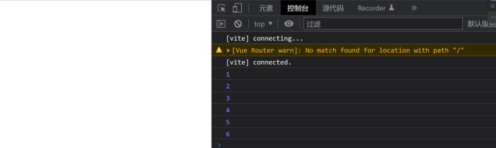

**小提示 本章内容所讲的东西都是实验性的产物 暂时不要再生产环境使用，自己开发玩可以使用，不过大体框架应该不会变了。**

要求 vue 版本 3.2.25 及以上

## 1.开启配置（开启之后才能使用新特性）

vite  开启  reactivityTransform

```typescript
import { fileURLToPath, URL } from 'url'
import { defineConfig } from 'vite'
import vue from '@vitejs/plugin-vue'
import vueJsx from '@vitejs/plugin-vue-jsx'
// https://vitejs.dev/config/
export default defineConfig({
  server: {
    port: 3000
  },
  plugins: [
    vue({
      reactivityTransform:true
    }),
   vueJsx()],
  resolve: {
    alias: {
      '@': fileURLToPath(new URL('./src', import.meta.url))
    }
  },
})
```

如果你是 vue-cli

```ts
// vue.config.js
module.exports = {
  chainWebpack: (config) => {
    config.module
      .rule('vue')
      .use('vue-loader')
      .tap((options) => {
        return {
          ...options,
          reactivityTransform: true
        }
      })
  }
}
```

 第一个例子 `$ref`

在之前 ref 修改值 和 获取值 都要.value 一下 感觉很繁琐，不想用.value 我们可以使用 vue3 的新特性$ref 。

==我们可以直接使用$ref 宏函数 就不需要.value 了。能帮我们快速书写，但是宏函数是基于运行时的他最终还是会转换成 ref 加.value 只不过 vue 帮我们做了这个操作了==

```vue
<template>
    <div>
        <button @click="add">add</button>
    </div>
    <h2>
        {{count}}
    </h2>
</template>

<script setup lang='ts'>
import { $ref } from 'vue/macros'
let count = $ref(0)

const add = () => {
   count++
}
</script>

<style>
</style>
```

当然跟 ref 有关的函数都做处理 都不需要.value 了

- [ref](https://cn.vuejs.org/api/reactivity-core.html#ref "ref") -> `$ref`
- [computed](https://cn.vuejs.org/api/reactivity-core.html#computed "computed") -> `$computed`
- [shallowRef](https://cn.vuejs.org/api/reactivity-advanced.html#shallowref "shallowRef") -> `$shallowRef`
- [customRef](https://cn.vuejs.org/api/reactivity-advanced.html#customref "customRef") -> `$customRef`
- [toRef](https://cn.vuejs.org/api/reactivity-utilities.html#toref "toRef") -> `$toRef`

### 2.$ref 的弊端

应为他编译之后就是  `count.value` 并不是一个 `ref 对象` 所以 `watch` 无法监听而且会抛出一个警告

```sh
[Vue warn]: Invalid watch source:  0 A watch source can only be a getter/effect function, a ref, a reactive object, or an array of these types.
  at <App>
```

```vue
<template>
</template>

<script setup lang='ts'>
import { reactive, ref, toRefs,watch } from 'vue';
import { $ref} from 'vue/macros'

let count = $ref<number>(0)

watch(count,(v)=>{
    console.log(v)
})


setInterval(()=>{
    count++
},1000)


</script>

<style>
</style>
```

解决这个问题需要 `$$` 符号 就是再让他编译的时候变成一个 ref 对象不加.value

```vue
<template>
</template>

<script setup lang='ts'>
import { reactive, ref, toRefs,watch } from 'vue';
import { $ref,$$ } from 'vue/macros'

let count = $ref<number>(0)

watch($$(count),(v)=>{
    console.log(v)
})


setInterval(()=>{
    count++
},1000)


</script>

<style>
</style>
```



### 3.解构  

在之前我们解构一个对象使用 `toRefs` 解构完成之后 获取值和修改值 还是需要.value [07-to系列全家桶](07-to系列全家桶.md)

vue3 也提供了 语法糖   `$()` 解构完之后可以直接赋值

```vue
<template>
    <div>
        {{name}}
    </div>
</template>

<script setup lang='ts'>
import { reactive, toRefs } from 'vue'
import {$} from 'vue/macros'
const obj = reactive({
    name: '小满'
})

let { name } = $(obj);


setTimeout(()=>{
   name = '大满'
},2000)

</script>

<style>
</style>
```