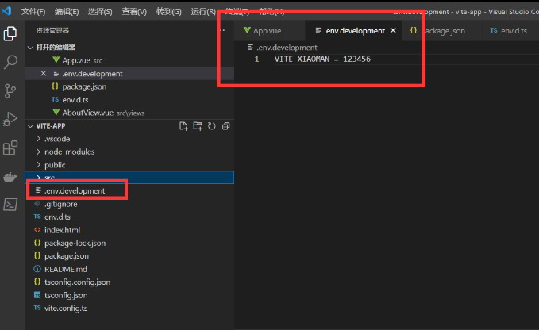
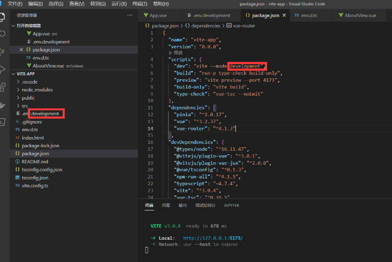
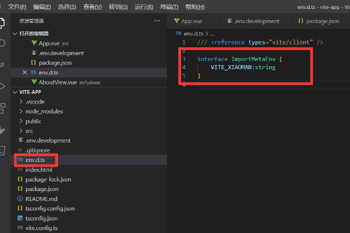
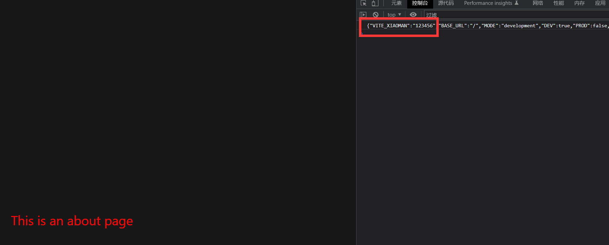
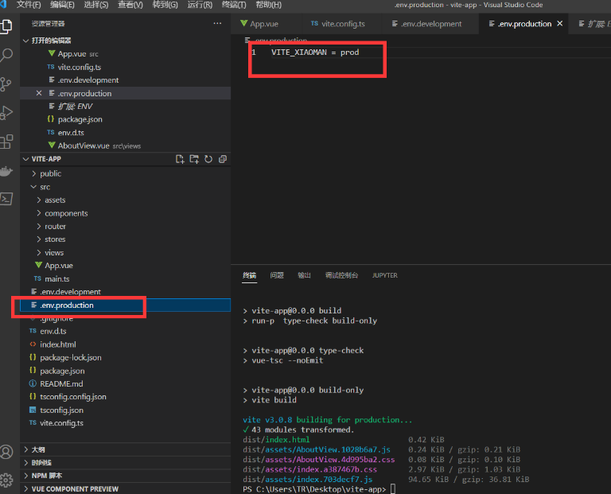
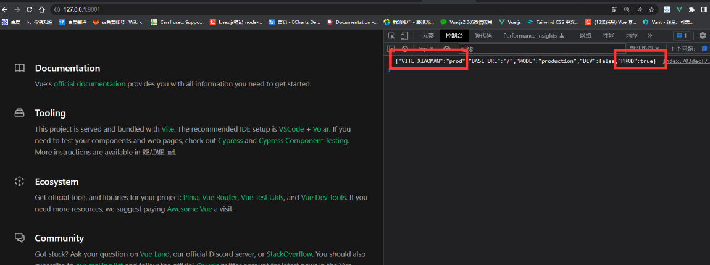
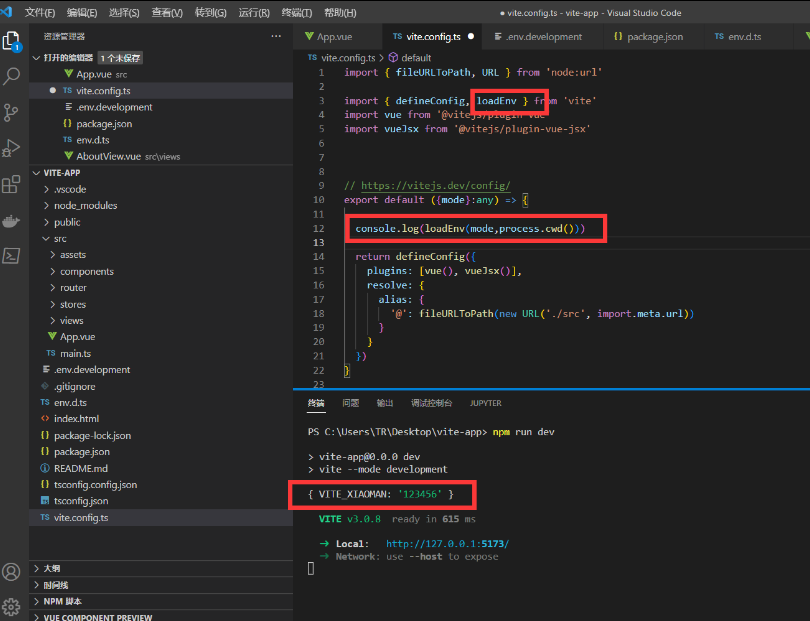

# 环境变量
环境变量：他的主要作用就是让开发者区分不同的运行环境，来实现 兼容开发和生产

例如 npm run dev 就是开发环境 npm run build 就是生产环境等等

`Vite` 在一个特殊的 `1mport.meta.env` 对象上暴露环境变量。这里有一些在所有情况下都可以使用的内建变量
<!-- 不能出现import.meta.env  -->

```json
{
"BASE_URL":"/", //部署时的URL前缀
"MODE":"development", //运行模式
"DEV":true,//是否在dev环境
"PROD":false, //是否是build 环境
"SSR":false //是否是SSR 服务端渲染模式
}
```

需要注意的一点就是这个环境变量不能使用动态赋值 `1mport.meta.env[key]` 应为这些环境变量在打包的时候是会被硬编码的通过 `JSON.stringify` 注入浏览器的

### 配置额外的环境变量

在根目录新建 env 文件 可以创建多个

如下 `env.[name]`



### 修改启动命令

在 package json 配置 `--mode env` 文件名称



### 配置智能提示

```ts
interface ImportMetaEnv {
    VITE_XIAOMAN:string
}
```



然后 App.vue 输出 `JSON.stringify(import.meta.env)`



就已经添加进去了

### 生产环境使用

创建  `.env.production`  在执行 `npm run build` 的时候他会自己加载这个文件





### 如果想在 vite.config.ts 使用环境变量



```ts
import { fileURLToPath, URL } from 'node:url'

import { defineConfig, loadEnv } from 'vite'
import vue from '@vitejs/plugin-vue'
import vueJsx from '@vitejs/plugin-vue-jsx'

console.log(process.env); //node 的方法

// https://vitejs.dev/config/
export default ({mode}:any) => {

  console.log(loadEnv(mode,process.cwd()))

  return defineConfig({
    plugins: [vue(), vueJsx()],
    resolve: {
      alias: {
        '@': fileURLToPath(new URL('./src', import.meta.url))
      }
    }
  })
}
```

我们就可以通过环境变量这个值 做一些事情比如 切换接口 url 等