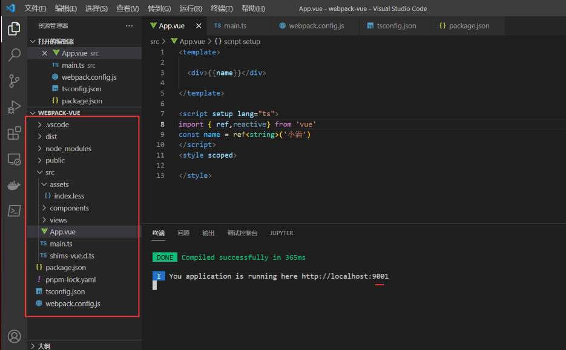
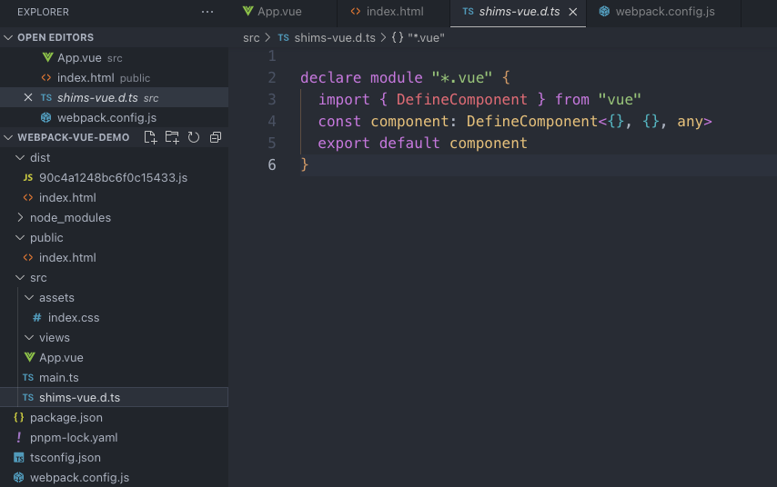
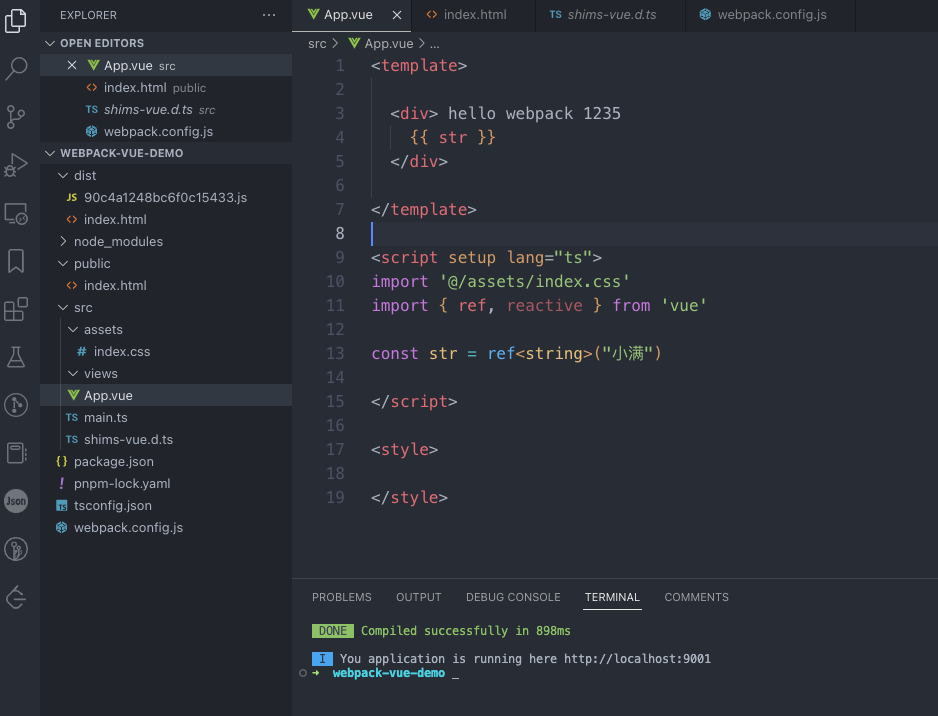
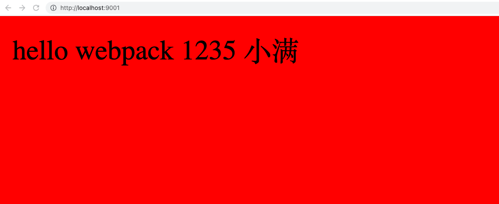

**为什么要手写 webpack 不用 cli （脑子有病）并不是 其实是为了加深我们对 webpack 的了解方便以后灵活运用 webpack 的技术**


> 示例 [Huxzhi](https://github.com/Huxzhi)/[webpack-vue-demo](https://github.com/Huxzhi/webpack-vue-demo)

### 1. 初始化项目结构（跟 cli 结构保持一致）



###  2. 安装所需要的依赖包

```json
{
    "name": "webpack-vue",
    "version": "1.0.0",
    "description": "",
    "main": "webpack.config.js",
    "scripts": {
        "test": "echo \"Error: no test specified\" && exit 1",
        "dev": "webpack-dev-server",
        "build": "webpack"
    },
    "keywords": [],
    "author": "",
    "license": "ISC",
    "dependencies": {
        "@vue/compiler-sfc": "^3.2.38", //解析vue文件
        "clean-webpack-plugin": "^4.0.0", //打包 的时候清空dist
        "css-loader": "^6.7.1", //处理css文件
        "friendly-errors-webpack-plugin": "^1.7.0", //美化dev
        "html-webpack-plugin": "^5.5.0", //html 模板
        "less": "^4.1.3",  //处理less
        "less-loader": "^11.0.0", //处理less文件
        "style-loader": "^3.3.1", //处理style样式
        "ts-loader": "^9.3.1", //处理ts
        "typescript": "^4.8.2", //ts
        "vue": "^3.2.38", //vue
        "vue-loader": "^17.0.0", //解析vue
        "webpack": "^5.74.0",
        "webpack-cli": "^4.10.0",
        "webpack-dev-server": "^4.10.0"
    }
}
```

### 3. tsc --init 生成 ts 文件 如果没有 tsc 安装 npm install typescript -g

```typescript
{
  "compilerOptions": {
    "target": "esnext",
    "module": "esnext",
    "strict": true,
    "jsx": "preserve",
    "importHelpers": true,
    "moduleResolution": "node",
    "skipLibCheck": true,
    "esModuleInterop": true,
    "allowSyntheticDefaultImports": true,
    "sourceMap": true,
    "baseUrl": ".",
    "paths": {
      "@/*": [
        "src/*"
      ]
    },
    "lib": [
      "esnext",
      "dom",
      "dom.iterable",
      "scripthost"
    ]
  },
  "include": [
    "src/**/*.ts",
    "src/**/*.tsx",
    "src/**/*.vue",
    "tests/**/*.ts",
    "tests/**/*.tsx"
  ],
  "exclude": [
    "node_modules"
  ]
}
```

### 4. 配置 vue 声明文件不然 ts 识别不了 vue 后缀

> 现在不写也没事

```ts
declare module "*.vue" {
    import { DefineComponent } from "vue"
    const component: DefineComponent<{}, {}, any>
    export default component
  }
```



### 5. 编写 webpack config  js

```js
const { Configuration } = require('webpack')
const path = require('path')
const htmlWebpackPlugin = require('html-webpack-plugin')
const { VueLoaderPlugin } = require('vue-loader/dist/index');
const FriendlyErrorsWebpackPlugin = require("friendly-errors-webpack-plugin");
/**
 * @type {Configuration} //配置智能提示
 */
const config = {
    mode: "development",
    entry: './src/main.ts', //入口文件
    output: {
        filename: "[hash].js",
        path: path.resolve(__dirname, 'dist'), //出口文件
        clean: true, //代替plugins: [new CleanWebpackPlugin(),] //打包清空dist
    },
    module: {
        rules: [{
                test: /\.vue$/, //解析vue 模板
                use: "vue-loader"
            },
            {
                test: /\.less$/, //解析 less
                use: ["style-loader", "css-loader", "less-loader"],
            },
            {
                test: /\.css$/, //解析css
                use: ["style-loader", "css-loader"],
            },
            {
                test: /\.ts$/, //解析ts
                loader: "ts-loader",
                options: {
                    configFile: path.resolve(process.cwd(), 'tsconfig.json'),
                    appendTsSuffixTo: [/\.vue$/]
                },
            }
        ]
    },
    plugins: [
        new htmlWebpackPlugin({
            template: "./public/index.html" //html模板
        }),

        new VueLoaderPlugin(), //解析vue
        new FriendlyErrorsWebpackPlugin({
            compilationSuccessInfo: { //美化样式
                messages: ['You application is running here http://localhost:9001']
            }

        })
    ],
    resolve: {
        alias: {
            "@": path.resolve(__dirname, './src') // 别名
        },
        extensions: ['.js', '.json', '.vue', '.ts', '.tsx'] //识别后缀
    },
    stats: "errors-only", //取消提示
    devServer: {
        proxy: {},
        port: 9001,
        hot: true,
        open: true,
    },
    externals: {
        vue: "Vue" //CDN 引入
    },
}


module.exports = config
```

### 6. 看效果



