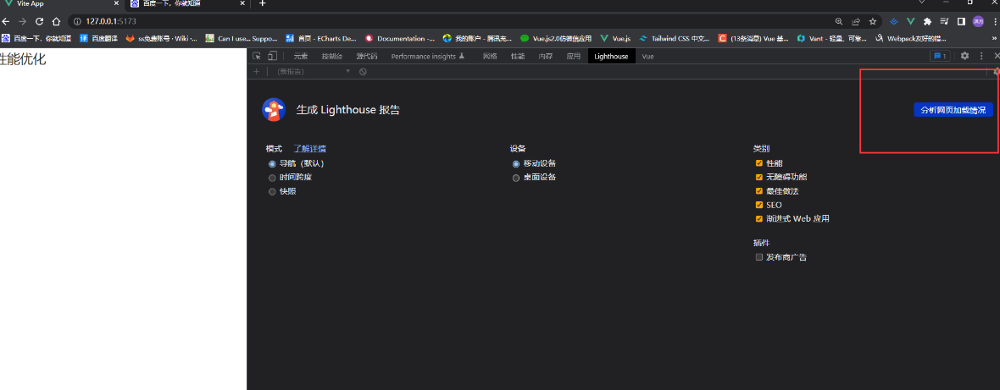
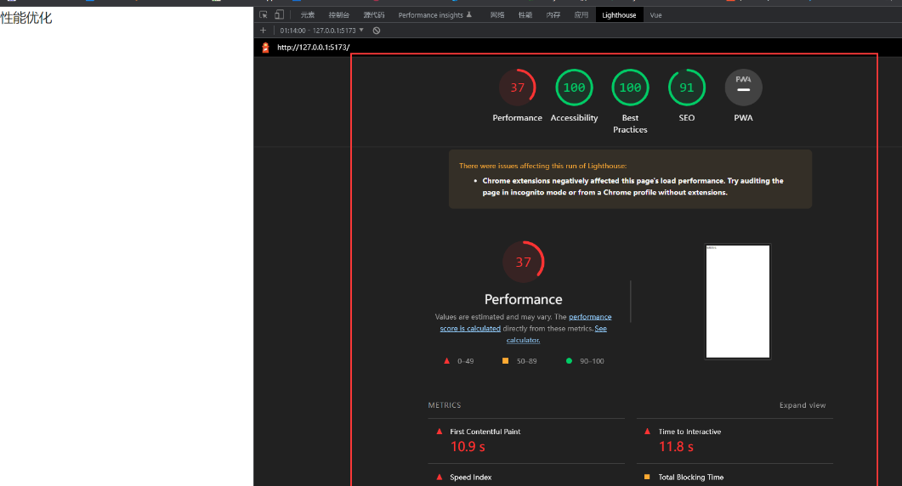
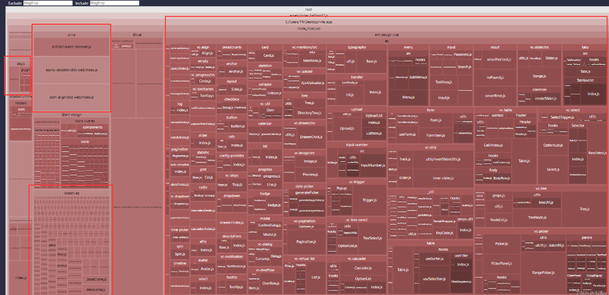
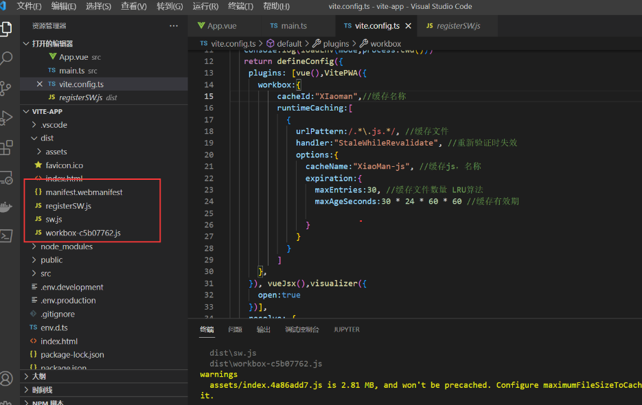
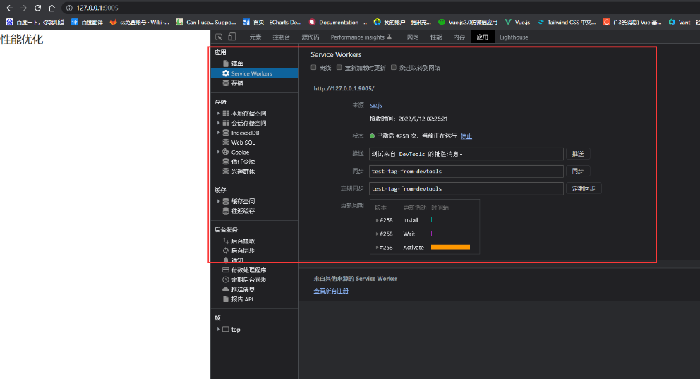
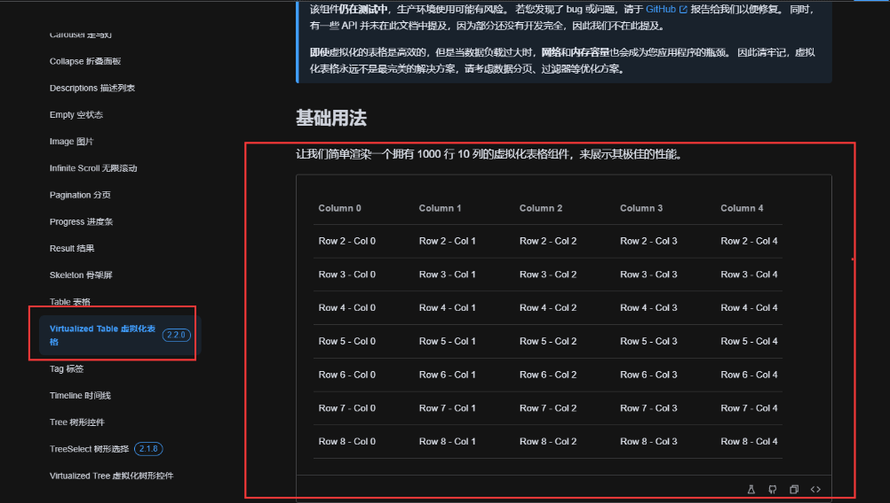
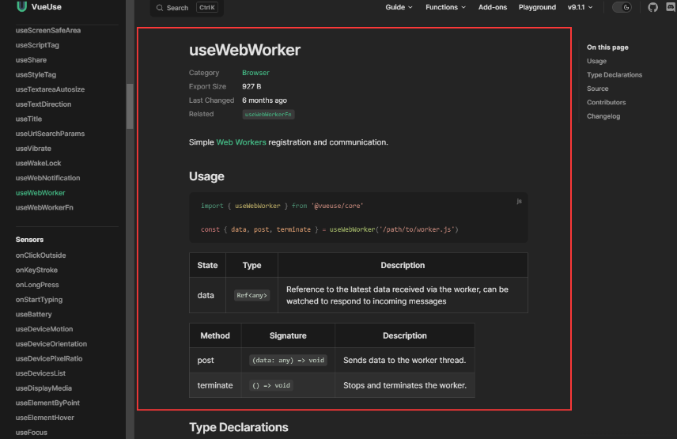
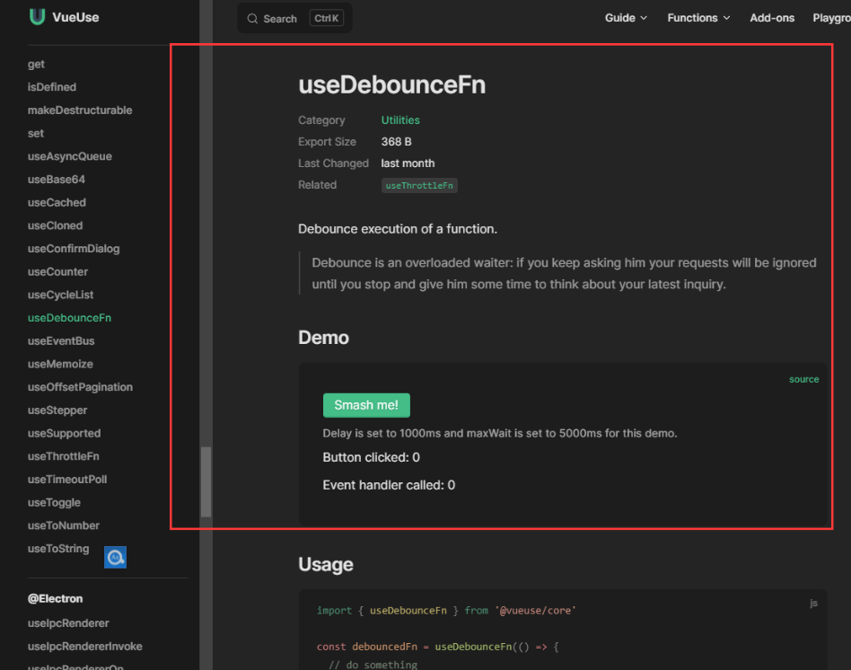

## 性能优化

我们可以使用谷歌浏览器自带的 `DevTools`  进行性能分析 `LightHouse`





## 参数介绍

从 Performance 页的表现结果来看，得分 37 分，并提供了很多的时间信息，我们来解释下这些选项代表的意思：

FCP (First Contentful Paint)：首次内容绘制的时间，浏览器第一次绘制 DOM 相关的内容，也是用户第一次看到页面内容的时间。

Speed Index: 页面各个可见部分的显示平均时间，当我们的页面上存在轮播图或者需要从后端获取内容加载时，这个数据会被影响到。

LCP (Largest Contentful Paint)：最大内容绘制时间，页面最大的元素绘制完成的时间。

TTI（Time to Interactive）：从页面开始渲染到用户可以与页面进行交互的时间，内容必须渲染完毕，交互元素绑定的事件已经注册完成。

TBT（Total Blocking Time）：记录了首次内容绘制到用户可交互之间的时间，这段时间内，主进程被阻塞，会阻碍用户的交互，页面点击无反应。

CLS（Cumulative Layout Shift）：计算布局偏移值得分，会比较两次渲染帧的内容偏移情况，可能导致用户想点击 A 按钮，但下一帧中，A 按钮被挤到旁边，导致用户实际点击了 B 按钮。

## 代码分析

由于我们使用的是 vite vite 打包是基于 rollup 的我们可以使用 rollup 的插件

```sh
npm install rollup-plugin-visualizer
```

vite.config.ts 配置 记得设置 open 不然无效

```ts
import { visualizer } from 'rollup-plugin-visualizer';
plugins: [vue(), vueJsx(),visualizer({
      open:true
 })],
```

然后进行 npm run build 打包



我在项目中使用了 Ant Design 发现 这个 UI 库非常庞大 这时候 就可以使用 Ant Design 的按需引入减少 包大小

## Vite 配置优化

```ts
build:{
       chunkSizeWarningLimit:2000,
       cssCodeSplit:true, //css 拆分
       sourcemap:false, //不生成sourcemap
       minify:false, //是否禁用最小化混淆，esbuild打包速度最快，terser打包体积最小。
       assetsInlineLimit:5000 //小于该值 图片将打包成Base64
},
```

## PWA 离线存储技术

```coffeescript
npm install vite-plugin-pwa -D
```

```ts
import { VitePWA } from 'vite-plugin-pwa'
plugins: [vue(),VitePWA(), vueJsx(),visualizer({
      open:true
})],
```

PWA 技术的出现就是让 web 网页无限接近于 Native 应用

1.  可以添加到主屏幕，利用 manifest 实现
2.  可以实现离线缓存，利用 service worker 实现
3.  可以发送通知，利用 service worker 实现

VitePWA 插件配置

```ts
VitePWA({
      workbox:{
          cacheId:"XIaoman",//缓存名称
          runtimeCaching:[
            {
              urlPattern:/.*\.js.*/, //缓存文件
              handler:"StaleWhileRevalidate", //重新验证时失效
              options:{
                cacheName:"XiaoMan-js", //缓存js，名称
                expiration:{
                  maxEntries:30, //缓存文件数量 LRU算法
                  maxAgeSeconds:30 * 24 * 60 * 60 //缓存有效期

                }
              }
            }
          ]
      },
    })
```

进行 npm run build 打包会生成 sw.js





## 其他性能优化

### 图片懒加载  

`import lazyPlugin from 'vue3-lazy'`

``

### 虚拟列表



### 多线程 使用   new Worker 创建

worker 脚本与主进程的脚本必须遵守同源限制。他们所在的路径协议、域名、端口号三者需要相同

```typescript
const myWorker1 = new Worker("./calcBox.js");
```

都使用 postMessage 发送消息

```scss
worker.postMessage(arrayBuffer, [arrayBuffer]);
```

都使用 onmessage 接收消息

```php
self.onmessage = function (e) { // xxx这里是worker脚本的内容
```

关闭

```scss
worker.terminate();
```

VueUse 库已经集成了 webWorker


防抖节流

同样 VueUse 也是集成了

