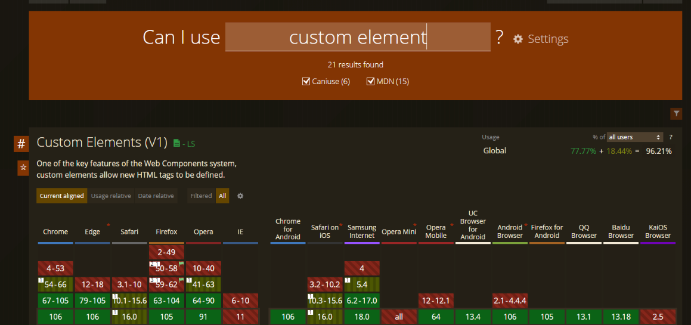
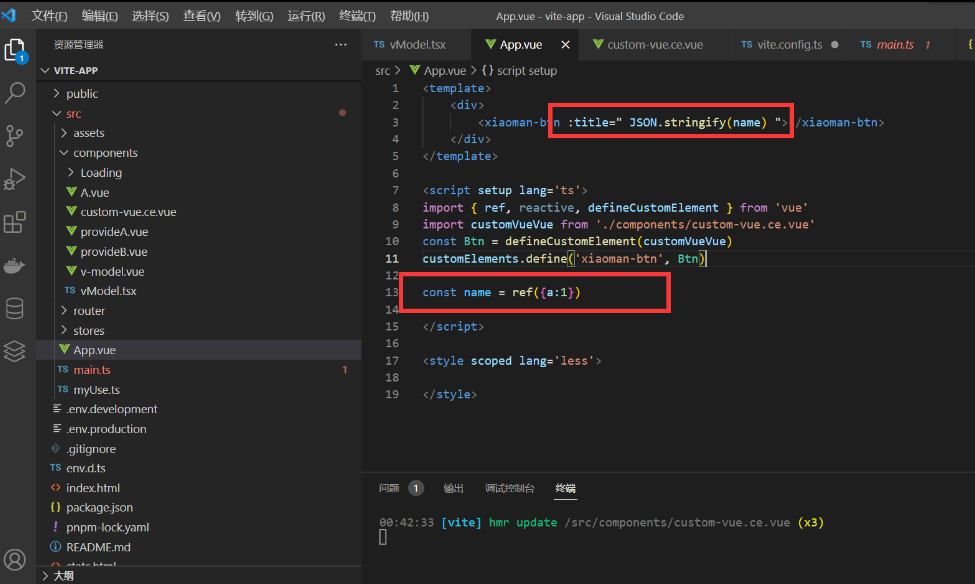
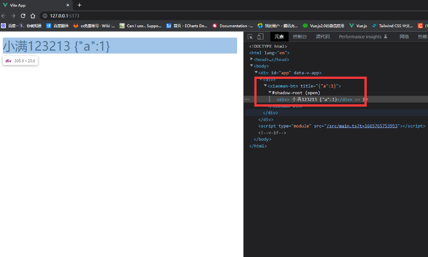

什么是 Web Components

Web Components 提供了基于原生支持的、对视图层的封装能力，可以让单个组件相关的 javaScript、css、html 模板运行在以 html 标签为界限的局部环境中，不会影响到全局，组件间也不会相互影响。

再简单来说：**就是提供了我们自定义标签的能力，并且提供了标签内完整的生命周期。**



**Custom elements（自定义元素）**：JavaScript API，允许定义 custom elements 及其行为，然后可以在我们的用户界面中按照需要使用它们。

**Shadow DOM（影子 DOM）**：JavaScript API，用于将封装的“影子”DOM 树附加到元素（与主文档 DOM 分开呈现）并控制其关联的功能。通过这种方式，开发者可以保持元素的功能私有，这样它们就可以被脚本化和样式化，而不用担心与文档的其他部分发生冲突。

**HTML templates（HTML 模板）**：和元素使开发者可以编写与 HTML 结构类似的组件和样式。然后它们可以作为自定义元素结构的基础被多次重用。

> 京东的跨端框架 Taro 的组件部分，就是用基于 Web Components 开发的

### 1.实战案例

```js
class Btn extends HTMLElement {
    constructor () {
        //调用super 来建立正确的原型链继承关系
        super()
        const p = this.h('p')
        p.innerText = '小满'
        p.setAttribute('style','height:200px;width:200px;border:1px solid #ccc;background:yellow')
        //表示 shadow DOM 子树的根节点。
        const shaDow = this.attachShadow({mode:"open"})

        shaDow.appendChild(this.p)
    }

    h (el) {
       return  document.createElement(el)
    }

    /**
     * 生命周期
     */
    //当自定义元素第一次被连接到文档 DOM 时被调用。
    connectedCallback () {
        console.log('我已经插入了！！！嗷呜')
    }

    //当自定义元素与文档 DOM 断开连接时被调用。
    disconnectedCallback () {
        console.log('我已经断开了！！！嗷呜')
    }

    //当自定义元素被移动到新文档时被调用
    adoptedCallback () {
        console.log('我被移动了！！！嗷呜')
    }
    //当自定义元素的一个属性被增加、移除或更改时被调用
    attributeChangedCallback () {
        console.log('我被改变了！！！嗷呜')
    }

}

window.customElements.define('xiao-man',Btn)
```

### 2.template 模式

```ts
class Btn extends HTMLElement {
    constructor() {
        //调用super 来建立正确的原型链继承关系
        super()
        const template = this.h('template')
        template.innerHTML = `
        <div>小满</div>
        <style>
            div{
                height:200px;
                width:200px;
                background:blue;
            }
        </style>
        `
        //表示 shadow DOM 子树的根节点。
        const shaDow = this.attachShadow({ mode: "open" })

        shaDow.appendChild(template.content.cloneNode(true))
    }

    h(el) {
        return document.createElement(el)
    }

    /**
     * 生命周期
     */
    //当自定义元素第一次被连接到文档 DOM 时被调用。
    connectedCallback() {
        console.log('我已经插入了！！！嗷呜')
    }

    //当自定义元素与文档 DOM 断开连接时被调用。
    disconnectedCallback() {
        console.log('我已经断开了！！！嗷呜')
    }

    //当自定义元素被移动到新文档时被调用
    adoptedCallback() {
        console.log('我被移动了！！！嗷呜')
    }
    //当自定义元素的一个属性被增加、移除或更改时被调用
    attributeChangedCallback() {
        console.log('我被改变了！！！嗷呜')
    }

}

window.customElements.define('xiao-man', Btn)
```

使用方式

```html
<!DOCTYPE html>
<html lang="en">
<head>
    <meta charset="UTF-8">
    <meta http-equiv="X-UA-Compatible" content="IE=edge">
    <meta name="viewport" content="width=device-width, initial-scale=1.0">
    <title>web Component</title>
    <script src="./btn.js"></script>
</head>
<body>
    <xiao-man></xiao-man>
</body>
</html>
```

### 3.如何在 Vue 使用

defineCustomElement

告知 vue 这是一个自定义 Component 跳过组件检查

```ts
/*vite config ts 配置*/
vue({
   template:{
     compilerOptions:{
         isCustomElement:(tag)=> tag.includes('xiaoman-')
      }
    }
})
```

父组件

```vue
<template>
    <div>
        <xiaoman-btn :title=" JSON.stringify(name) "></xiaoman-btn>
    </div>
</template>

<script setup lang='ts'>
import { ref, reactive, defineCustomElement } from 'vue'
//自定义元素模式  要开启这个模式，只需要将你的组件文件以 .ce.vue 结尾即可
import customVueVue from './components/custom-vue.ce.vue'
const Btn = defineCustomElement(customVueVue)
customElements.define('xiaoman-btn', Btn)

const name = ref({a:1})

</script>

<style scoped lang='less'>

</style>
```

子组件

```vue
<template>
    <div>

        小满123213 {{title}}
    </div>
</template>

<script setup lang='ts'>

import { ref, reactive } from 'vue'

defineProps<{
    title:string
}>()

</script>

<style scoped lang='less'>

</style>
```

传递参数 如果是对象需要序列化 他是作用于 标签上的



