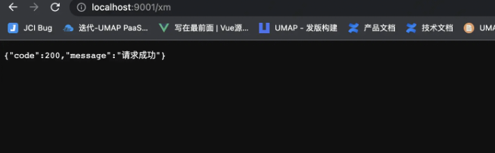
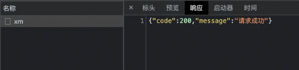
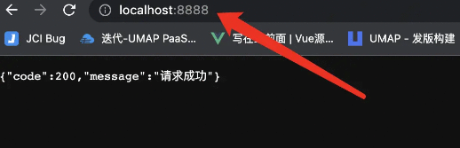

# Vue3 proxy 解决跨域

## 1.首先我们先了解一下什么是跨域

主要是出于浏览器的同源策略限制，它是浏览器最核心也最基本的安全功能。

当一个请求 url 的 **协议、域名、端口** 三者之间任意一个与当前页面 url 不同即为跨域。

例如 [xxxx.com](https://link.juejin.cn/?target=http%3A%2F%2Fxxxx.com "http://xxxx.com") -> [xxxx.com](https://link.juejin.cn/?target=https%3A%2F%2Fxxxx.com "https://xxxx.com") 存在跨域 **协议不同**

例如 127.x.x.x:8001 -> 127.x.x.x:8002 存在跨域 **端口不同**

例如 [www.xxxx.com](https://link.juejin.cn/?target=http%3A%2F%2Fwww.xxxx.com "http://www.xxxx.com") -> [www.yyyy.com](https://link.juejin.cn/?target=http%3A%2F%2Fwww.yyyy.com "http://www.yyyy.com") 存在跨域 **域名不同**

## 2.如何解决跨域

jsonp 这种方式在之前很常见，他实现的基本原理是利用了 HTML 里 script 元素标签没有跨域限制 动态创建 script 标签，将 src 作为服务器地址，服务器返回一个 callback 接受返回的参数

```js
function clickButton() {
    let obj, s
    obj = { "table":"products", "limit":10 }; //添加参数
    s =  document.createElement("script"); //动态创建script
    s.src = "接口地址xxxxxxxxxxxx"  + JSON.stringify(obj);
    document.body.appendChild(s);
 }
//与后端定义callback名称
function myFunc(myObj)  {
    //接受后端返回的参数
    document.getElementById("demo").innerHTML = myObj;
}
```

cors 设置 CORS 允许跨域资源共享 需要后端设置

```json
{
  "Access-Control-Allow-Origin": "http://web.xxx.com" //可以指定地址
}
```

```json
{
  "Access-Control-Allow-Origin": "*" //也可以使用通配符 任何地址都能访问 安全性不高
}
```

使用 Vite proxy 或者 node 代理 或者 webpack proxy 他们三种方式都是代理

我们先创建一个接口使用 express 简单构建一下

```js
const express = require('express')
const app = express()

//创建get请求
app.get('/xm',(req,res)=>{
     res.json({
        code:200,
        message:"请求成功"
     })
})
//端口号9001
app.listen(9001)
```



我们使用 vite 项目的 fetch 请求一下

```vue
<script lang="ts" setup>
import {ref,reactive } from 'vue'
fetch('http://localhost:9001/xm')
</script>
```


发现是存在跨域的,这时候我们就可以配合 vite 的代理来解决跨域 用法如下

需要在 `vite.config.js/ts` 进行配置

```ts
export default defineConfig({
  plugins: [vue()],
  server:{
     proxy:{
        '/api':{
            target:"http://localhost:9001/", //跨域地址
            changeOrigin:true, //支持跨域
            rewrite:(path) => path.replace(/^\/api/, "")//重写路径,替换/api
        }
     }
  }
})
```

fetch 替换/api 他会截取/api 替换成 target 地址

```vue
<script lang="ts" setup>
import {ref,reactive } from 'vue'
fetch('/api/xm')
</script>
```



webpack proxy 和 node proxy 用法都类似

## 3.vite proxy 原理解析

vite 源码地址[github.com/vitejs/vite](https://link.juejin.cn/?target=https%3A%2F%2Fgithub.com%2Fvitejs%2Fvite "https://github.com/vitejs/vite")

源码路径 [vite](https://link.juejin.cn/?target=https%3A%2F%2Fgithub.com%2Fvitejs%2Fvite "https://github.com/vitejs/vite")/[packages](https://link.juejin.cn/?target=https%3A%2F%2Fgithub.com%2Fvitejs%2Fvite%2Ftree%2Fmain%2Fpackages "https://github.com/vitejs/vite/tree/main/packages")/[vite](https://link.juejin.cn/?target=https%3A%2F%2Fgithub.com%2Fvitejs%2Fvite%2Ftree%2Fmain%2Fpackages%2Fvite "https://github.com/vitejs/vite/tree/main/packages/vite")/[src](https://link.juejin.cn/?target=https%3A%2F%2Fgithub.com%2Fvitejs%2Fvite%2Ftree%2Fmain%2Fpackages%2Fvite%2Fsrc "https://github.com/vitejs/vite/tree/main/packages/vite/src")/[node](https://link.juejin.cn/?target=https%3A%2F%2Fgithub.com%2Fvitejs%2Fvite%2Ftree%2Fmain%2Fpackages%2Fvite%2Fsrc%2Fnode "https://github.com/vitejs/vite/tree/main/packages/vite/src/node")/[server](https://link.juejin.cn/?target=https%3A%2F%2Fgithub.com%2Fvitejs%2Fvite%2Ftree%2Fmain%2Fpackages%2Fvite%2Fsrc%2Fnode%2Fserver "https://github.com/vitejs/vite/tree/main/packages/vite/src/node/server")/**index.ts** vite 源码 发现他处理 proxy 是调用了 proxyMiddleware

```ts
// proxy
const { proxy } = serverConfig
if (proxy) {
 middlewares.use(proxyMiddleware(httpServer, proxy, config))
}
```

[vite](https://link.juejin.cn/?target=https%3A%2F%2Fgithub.com%2Fvitejs%2Fvite%2Ftree%2Fd76db0cae645beaecd970d95b4819158c5dd568a "https://github.com/vitejs/vite/tree/d76db0cae645beaecd970d95b4819158c5dd568a")/[packages](https://link.juejin.cn/?target=https%3A%2F%2Fgithub.com%2Fvitejs%2Fvite%2Ftree%2Fd76db0cae645beaecd970d95b4819158c5dd568a%2Fpackages "https://github.com/vitejs/vite/tree/d76db0cae645beaecd970d95b4819158c5dd568a/packages")/[vite](https://link.juejin.cn/?target=https%3A%2F%2Fgithub.com%2Fvitejs%2Fvite%2Ftree%2Fd76db0cae645beaecd970d95b4819158c5dd568a%2Fpackages%2Fvite "https://github.com/vitejs/vite/tree/d76db0cae645beaecd970d95b4819158c5dd568a/packages/vite")/[src](https://link.juejin.cn/?target=https%3A%2F%2Fgithub.com%2Fvitejs%2Fvite%2Ftree%2Fd76db0cae645beaecd970d95b4819158c5dd568a%2Fpackages%2Fvite%2Fsrc "https://github.com/vitejs/vite/tree/d76db0cae645beaecd970d95b4819158c5dd568a/packages/vite/src")/[node](https://link.juejin.cn/?target=https%3A%2F%2Fgithub.com%2Fvitejs%2Fvite%2Ftree%2Fd76db0cae645beaecd970d95b4819158c5dd568a%2Fpackages%2Fvite%2Fsrc%2Fnode "https://github.com/vitejs/vite/tree/d76db0cae645beaecd970d95b4819158c5dd568a/packages/vite/src/node")/[server](https://link.juejin.cn/?target=https%3A%2F%2Fgithub.com%2Fvitejs%2Fvite%2Ftree%2Fd76db0cae645beaecd970d95b4819158c5dd568a%2Fpackages%2Fvite%2Fsrc%2Fnode%2Fserver "https://github.com/vitejs/vite/tree/d76db0cae645beaecd970d95b4819158c5dd568a/packages/vite/src/node/server")/[middlewares](https://link.juejin.cn/?target=https%3A%2F%2Fgithub.com%2Fvitejs%2Fvite%2Ftree%2Fd76db0cae645beaecd970d95b4819158c5dd568a%2Fpackages%2Fvite%2Fsrc%2Fnode%2Fserver%2Fmiddlewares "https://github.com/vitejs/vite/tree/d76db0cae645beaecd970d95b4819158c5dd568a/packages/vite/src/node/server/middlewares")/**proxy.ts**

找到 proxyMiddleware 发现他是调用了 http-proxy 这个库

```ts
import httpProxy from 'http-proxy'
export function proxyMiddleware(
    httpServer: http.Server | null,
    options: NonNullable<CommonServerOptions['proxy']>,
    config: ResolvedConfig
  ): Connect.NextHandleFunction {
    // lazy require only when proxy is used
const proxy = httpProxy.createProxyServer(opts) as HttpProxy.Server
```

http-proxy npm 地址 [www.npmjs.com/package/htt…](https://link.juejin.cn/?target=https%3A%2F%2Fwww.npmjs.com%2Fpackage%2Fhttp-proxy "https://www.npmjs.com/package/http-proxy")

http-proxy 模块用于转发 http 请求，其实现的大致原理为使用 http 或 https 模块搭建 node 代理服务器，将客户端发送的请求数据转发到目标服务器，再将响应输送到客户端

```ts
const http = require('http')

const httpProxy = require('http-proxy')

const proxy = httpProxy.createProxyServer({})

//创建一个代理服务 代理到9001
http.createServer((req,res)=>{
    proxy.web(req,res,{
        target:"http://localhost:9001/xm", //代理的地址
        changeOrigin:true, //是否有跨域
        ws:true //webSocetk
    })
}).listen(8888)
```

9001 服务

```ts
const express = require('express')
const app = express()

//创建get请求
app.get('/xm',(req,res)=>{
     res.json({
        code:200,
        message:"请求成功"
     })
})
//端口号9001
app.listen(9001)
```

成功代理 访问 8888 端口代理 9001 的请求



[查看原网页: juejin.cn](https://juejin.cn/post/7170952274045304868)