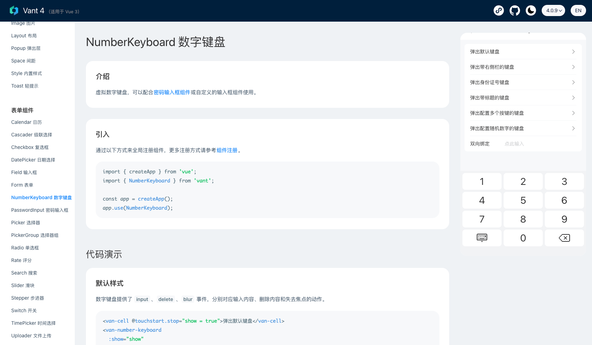

# 数字键盘

## 场景1
输入法一定是安全的吗？在之前也曾曝出不少输入法搜集用户信息获取照片权限，通讯录权限，等。

试想一下当你使用某种聊天工具，在跟朋友探讨一件商品，过了一会儿，在某度，某宝，某东可能就推荐了。

## 场景2
在我们使用微信，支付宝，等支付软件付款的时候，发现键盘是App 自带的，并非第三方输入法

这个是由于第三方软件输入的频次过多他会把密码记录下来，其二就是如果三方输入法被木马入侵，也容易盗取我们的密码造成损失。

所以在我们开发移动端的时候遇到支付都会使用虚拟键盘

## vant组件-数字键盘

