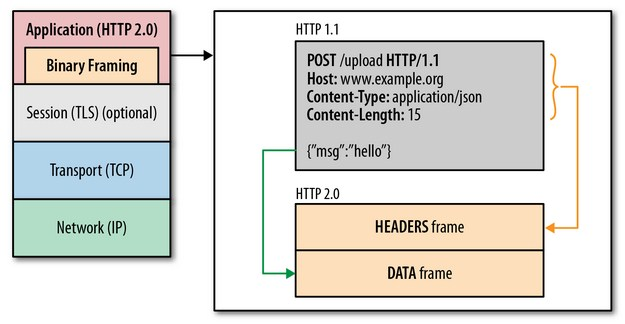
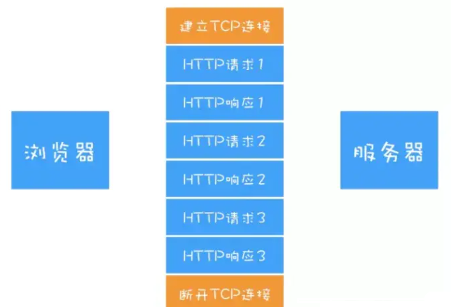
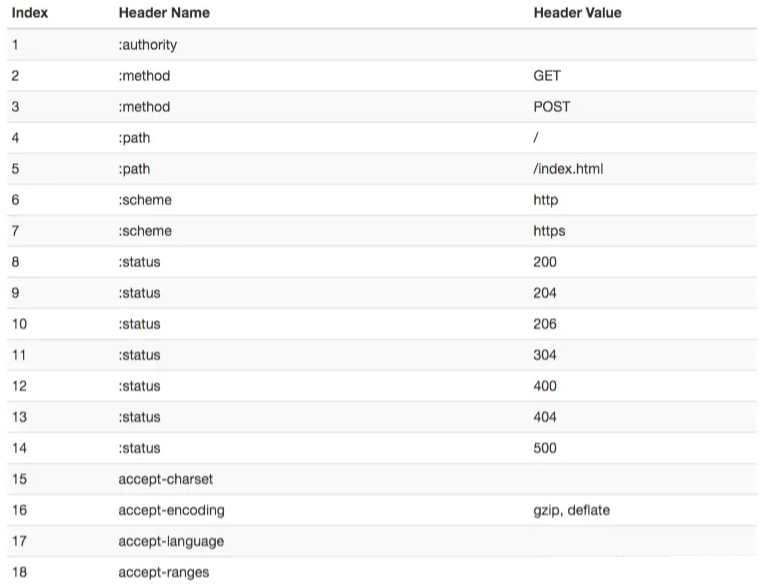

# http1.1 http2

HTTP/2 采用二进制格式而非文本格式
HTTP/2 是完全多路复用的，而非有序并阻塞的——只需一个连接即可实现并行
使用报头压缩，HTTP/2 降低了开销
HTTP/2 让服务器可以将响应主动“推送”到客户端缓存中

## 1.二进制分帧层

在二进制分帧层上，HTTP 2.0 会将所有传输的信息分割为更小的消息和帧,并对它们采用二进制格式的编码 ，其中 HTTP1.x 的首部信息会被封装到 Headers 帧，而我们的 request body 则封装到 Data 帧里面。

2.多路复用

从上图可以看出，HTTP 的持久连接可以有效减少 TCP 建立连接和断开连接的次数，这样的好处是减少了服务器额外的负担，并提升整体 HTTP 的请求时间

3.头部压缩

- 维护一份相同的静态字典，包含常见的头部名称，以及常见的头部名称和值的组合
- 维护一份相同的动态字典，可以动态的添加内容
- 通过静态 Huffman 编码对传输的首部字段进行编码

[演示 demoHTTP/2: the Future of the Internet | Akamai](https://http2.akamai.com/demo "演示demoHTTP/2: the Future of the Internet | Akamai")

## 4.客户端缓存

### 协商缓存

协商缓存就是通过服务器来判断缓存是否可用

`Last-Modify` 搭配 `If-Modify-Since:` 浏览器第一次请求一个资源的时候，服务器返回的 header 中会加上 Last-Modify，Last-modify 是该资源的最后修改时间；当浏览器再次请求该资源时，request 的请求头中会包含 If-Modify-Since，该值服务端 header 中返回的 Last-Modify。服务器收到 If-Modify-Since 后，根据资源的最后修改时间判断是否命中缓存

Etag 搭配 If-None-Match：web 服务器响应请求时，会在 header 中加一个 Etag 用来告诉浏览器当前资源在服务器的唯一标识（生成规则由服务器决定）。则再次向 web 服务器请求时带上头 If-None-Match （Etag 的值）。web 服务器收到请求后将 If-None-Match 与 Etag 进行比对，决定是否命中协商缓存；

`ETag` 和 `Last-Modified` 的作用和用法，他们的区别：

1.Etag 要优于 Last-Modified。Last-Modified 的时间单位是秒，如果某个文件在 1 秒内改变了多次，那么他们的 Last-Modified 其实并没有体现出来修改，但是 Etag 每次都会改变确保了精度；

2.在性能上，Etag 要逊于 Last-Modified，毕竟 Last-Modified 只需要记录时间，而 Etag 需要服务器通过算法来计算出一个 hash 值；

3.在优先级上，服务器校验优先考虑 Etag。

如果服务器收到的请求没有 Etag 值，则将 If-Modified-Since 和被请求文件的最后修改时间做比对，一致则命中协商缓存，返回 304；不一致则返回新的 last-modified 和文件并返回 200

### 强缓存

Expires:值为绝对时间，不过 Expires 是 HTTP 1.0 的东西，现在默认浏览器均默认使用 HTTP 1.1

`Cache-Control:`值为相对时间，如果与 Expires 同时设置的话，其优先级高于 Expires。

`cache-control` 有下面几个比较常用的设置值:

`-max-age:` 设置失效时间，客户端在这个有效期内，如果又请求该资源，就直接读取缓存

`-no-cache:` 不使用本地缓存。需要使用缓存协商，先与服务器确认返回的响应是否被更改，如果之前的响应中存在 ETag，那么请求的时候会与服务端验证，如果资源未被更改，则从缓存中取数据

`-no-store:` 直接禁止浏览器缓存数据，每次用户请求该资源，都会向服务器发送一个请求。

`-public:` 可以被所有的用户缓存，包括终端用户和 CDN 等中间代理服务器。

`-private:` 只能被终端用户的浏览器缓存，不允许 CDN 等中继缓存服务器对其缓存。

服务器通过设置 http 中 hdader 的 Expires 和 cache-control 字段告诉浏览器换存的有效期。这种方法会有一个固定时间，所带来的问题是如果服务器数据进行了更新，但是还没有到强缓存的过期时间，则数据无法更新
