# 计算机网络基础

## 第1章 概述

计算机网络是计算机技术与通信技术密切结合形成的交叉学科。

互联网 Internet 专有名词 采用TCP/IP协议族 前身是ARPANET

互连网 internet 通用名词

资源的种类：硬件资源，软件资源，数据资源，信道资源

互联网的组成

- 边缘部分：C/S

           P2P

- 核心部分：电路交换：建立连接（独占）-->数据通信-->释放连接

   报文交换：

   分组交换：

计算机网络的类别

定义

分类：按作用范围：WAL（广域网）、MAN（城域网）、LAN（局域网）

   按使用者：公用网、专用网

   扑朔结构

   接入网 ： 第一个路由器

计算机网络的性能

1. 速率（额定）
2. 带宽（最高）
3. 吞吐量（实际）表示在单位时间内通过某个网络（或信道、接口）的实际数据量。
4. 时延：    发送时延      发送第一个比特开始      数据帧长度（bit）/ 发送速率（bit/s）

传播时延      传播时间   信道长度（m）/传播速度（m/s）

处理时延

排队时延

计算机网络体系结构

|     | OSI/KM的体系结构 | TCP/IP协议                                        | 五层协议          |
| --- | ---------------- | ------------------------------------------------- | ----------------- |
| 7   | 应用层           | 应用层 （各种应用层协议如TELNET,FTP,SMTP等） | 5      应用层     |
| 6   | 表示层           | 运输层（TCP或UDP）                                | 4       运输层    |
| 5   | 会话层           | 网际层IP                                          | 3        网络层   |
| 4   | 运输层           | 网络接口层                                        | 2      数据链路层 |
| 3   | 网络层           | 1       物理层                                    |                   |
| 2   | 数据链路层       |                                                   |                   |
| 1   | 物理层           |                                                   |                   |

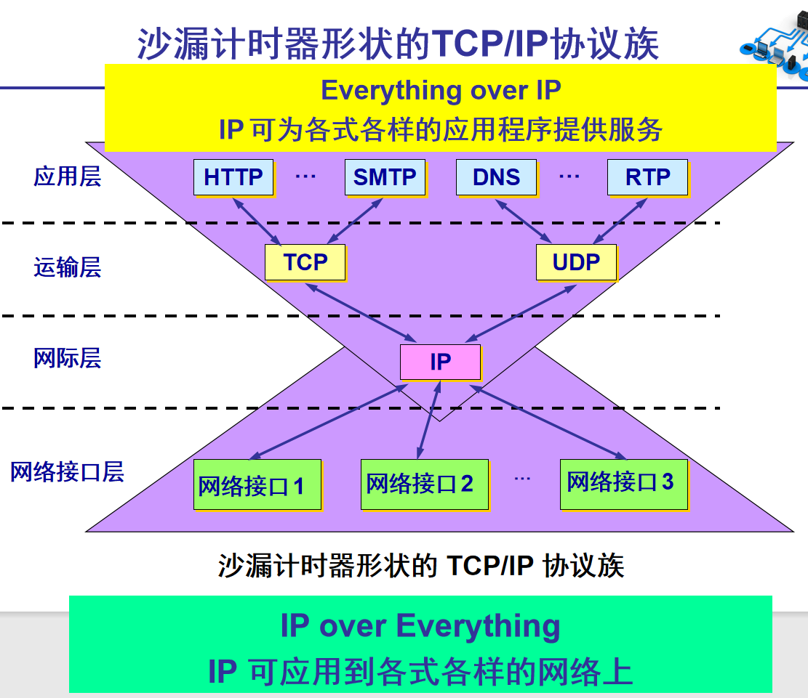

计算机网络中的数据交换必须遵守事先约定好的规则。 

网络协议 (network protocol)

简称为协议，是为进行网络中的数据交换而建立的规则、标准或约定。

协议的三要素：

语法：数据与控制信息的结构或格式 。 

语义：需要发出何种控制信息，完成何种动作以及做出何种响应。 

同步：事件实现顺序的详细说明。

各层完成的主要功能

可以是一种也可以多种

① 差错控制：使相应层次对等方的通信更加可靠。

② 流量控制：发送端的发送速率必须使接收端来得及接收，不要太快。

③ 分段和重装 ：发送端将要发送的数据块划分为更小的单位，在接收端将其还原。

④ 复用和分用：发送端几个高层会话复用一条低层的连接，在接收端再进行分用。

⑤ 连接建立和释放：交换数据前先建立一条逻辑连接，数据传送结束后释放连接。

具有五层协议的体系结构

1. **应用层**

应用层的任务是通过应用进程间的交互来完成特定网络应用。这里的“进程”是指主机中正在运行的程序

应用层交互地数据单元称为

报文（message）

1. **运输层**

运输层的任务就是负责向两台主机中进程间的通信提供通用的数据传输服务，由于一台主机可同时运行多个进程，因此运输层有复用和分用的功能。

复用就是多个应用层进程可同时使用下面运输层的服务，分用是运输层把收到的信息分别交付给应用层中的相应进程

主要是两种协议

- 传输控制协议TCP（Transmission Control Protocol）——提供面向连接的、可靠的数据传输服务，其数据传输的单位是报文段（segment）
- 用户数据报协议UDP（User Datagram Protocol）——提供无连接的、尽最大努力的数据传输服务（不保证数据传输的可靠性），其数据传输的单位是用户数据报。
1. **网络层**

网络层负责为分组交换网上的不同主机提供通信服务，能够实现异构网络互连、拥塞控制、路由选择

使用IP协议，因此分组也叫做

IP数据报

1. **数据链路层**

数据链路层的功能是：

封装成帧、差错控制、透明传输

1. **物理层**

物理层的功能：物理层上所传数据的单位是比特，确定与传输媒体的接口有关的一些特性，实现在连接各种计算机的传输媒体上数据比特流的传输，而且要尽可能地屏蔽掉这些传输媒体和通信手段的差异。这些特性包括

机械特性、电气特性、功能特性、过程特性

（指明对于不同功能的各种可能事件的出现顺序）

实体、协议、服务和服务访问点

实体 (entity) 表示任何可发送或接收信息的硬件或软件进程。 

协议是控制两个对等实体进行通信的规则的集合。

在协议的控制下，两个对等实体间的通信使得本层能够向上一层提供服务。要实现本层协议，还需要使用下层所提供的服务。上层使用服务原语获得下层所提供的服务。同一系统相邻两层的实体进行交互的地方，称为服务访问点 SAP (Service Access Point)。 

服务访问点SAP是一个抽象的概念，它实际上就是一个逻辑接口。

协议和服务的区别和联系

协议是“水平的”，即协议是控制对等实体之间通信的规则。

服务是“垂直的”，即服务是由下层向上层通过层间接口提供的。

本层的服务用户只能看见服务而无法看见下面的协议。即下面的协议对上面的服务用户是透明的。

在协议的控制下，两个对等实体间的通信使得本层能够向上一层提供服务。

要实现本层协议，还需要使用下层所提供的服务。

协议必须把所有不利的条件事先都估计到，而不能假定一切都是正常的和非常理想的。

第2章 物理层

屏蔽差异，串/并行转换

1.机械特性  接线器的形状和大小

2.电气特性   说明在接口电缆的哪条线上出现的电压应为什么范围。

3.功能特性  某一电平的电压的意义

4.过程特性 不同功能的各种可能事件的出现顺序

数据在通信路上一般是

串行传输

编码方式：不归零制，归零制，曼彻斯特编码，差分曼彻斯特编码

调制方法：调幅（AM）、调频（FM）、调相（PM），

更高的信息传输速率，正交振幅调制

信道的极限容量

奈氏准则：在理想条件下，为避免码间串扰，码元的传输极限

信噪比 S/N 单位dB =10log10（S/N）

香农公式 宽带受限+高斯白噪声 信息速率上限  

*C*=w *log2(1+S/N)  bit/s

W 为信道的带宽（以 Hz 为单位）；

S 为信道内所传信号的平均功率；

N 为信道内部的高斯噪声功率。

引导型传输媒体

1.双绞线 屏蔽双绞线（STP）

1、同种类型设备之间使用

[交叉线](https://baike.baidu.com/item/%E4%BA%A4%E5%8F%89%E7%BA%BF)

连接，不同类型设备之间使用直通线连接；

2、

[路由器](https://baike.baidu.com/item/%E8%B7%AF%E7%94%B1%E5%99%A8)

和PC属于DTE类型设备，交换机和HUB属于DCE类型设备；

2.同轴电缆

3.光缆

非引导型传输媒体

短波和微波

信道复用技术

信道复用技术

提高信道利用率

频分复用、时分复用、波分复用、码分复用，统计时分复用

有线宽带接入方式

ADSL(数字用户线)ps adsl Modem

HFC(有线电视网)Cable Modem

FTTx(光纤到x)

PON    OLT   光分路器  ONU

2、试说明10BASE-T中的“10”、“BASE”和“T”分别代表的含义。

10代表10Mbit/s ，BASE表示连接线上的信号是基带信号，T表示双绞线。

第3章 数据链路层

1.链路与数据链路区别

数据链路包括   

链路和协议

2.数据链路层PDU：帧

SOH帧开始符，EOT帧结束符

封装成帧=>帧定界

差错检测=>CRC 比特差错

透明传输=>避免错误帧定界，解决办法：字节填充和零比特填充

进行检错而添加的冗余码常称为帧校验序列FCS

发送端 M+FCS（n位）被除数（2^n · M）除数给定P（异或），P(X)称为生成多项式

接受端 M+R R‘=0，接受     R'=\ （不等于），丢弃

1 点对点协议PPP

PPP 是面向字节的，所有的 PPP 帧的长度都是整数字节

组成 将IP数据报封装串行链路的方法

LCP

NCP

帧格式 FF A C 协议 数据 FCS FF

PPP 有一个 2 个字节的协议字段。其值

若为 0x0021，则信息字段就是 IP 数据报。

若为 0x8021，则信息字段是网络控制数据。

若为 0xC021，则信息字段是 PPP 链路控制数据。

若为 0xC023，则信息字段是鉴别数据。

局域网特点

适配器的作用

1串并转换

2对数据进行缓存

3实现以太网协议，广播信道

计算机的硬件地址就存储在适配器的ROM中，而计算机的软件地址-IP地址，则在计算机的存储器中

1.CSMA/CD协议

载波监听多点接入/碰撞检测

使用 CSMA/CD 协议的以太网不能进行全双工通信而只能进行双向交替通信（半双工通信）

以太网的端到端往返时延 2 称为争用期，或碰撞窗口。

经过争用期这段时间还没有检测到碰撞，才能肯定这次发送不会发生碰撞

10 Mbit/s 以太网取 51.2 微秒 为争用期的长度。

对于 10 Mbit/s 以太网，在争用期内可发送 512 bit，即 64 字节。

帧间最小间隔为 9.6 微秒，相当于 96 bit 的发送时间。使刚刚收到数据帧的站的接收缓存来得及清理，做好接收下一帧的准备。

(1) 准备发送。但在发送之前，必须先检测信道。

(2) 检测信道。若检测到信道忙，则应不停地检测，一直等待信道转为空闲。若检测到信道空闲，并在 96 比特时间内信道保持空闲（保证了帧间最小间隔），就发送这个帧。

(3) 检查碰撞。在发送过程中仍不停地检测信道，即网络适配器要边发送边监听。这里只有两种可能性：

①发送成功：在争用期内一直未检测到碰撞。这个帧肯定能够发送成功。发送完毕后，其他什么也不做。然后回到 (1)。

②发送失败：在争用期内检测到碰撞。这时立即停止发送数据，并按规定发送人为干扰信号。适配器接着就执行截断二进制指数退避算法，等待 r 倍 512 比特时间后，返回到步骤 (2)，继续检测信道。但若重传达 16 次仍不能成功，则停止重传而向上报错。

采用双绞线的以太网采用星形拓扑，在星形的中心则增加了一种可靠性非常高的设备，叫做集线器 (hub)

2.MAC地址 48位

3.MAC帧(64-1518 B)帧首+数据+帧尾

当数据字段的长度小于 46 字节时，应在数据字段的后面加入整数字节的填充字段，

以保证以太网的 MAC 帧长不小于 64 字节。

有效的 MAC 帧长度为 64 ~ 1518 字节之间

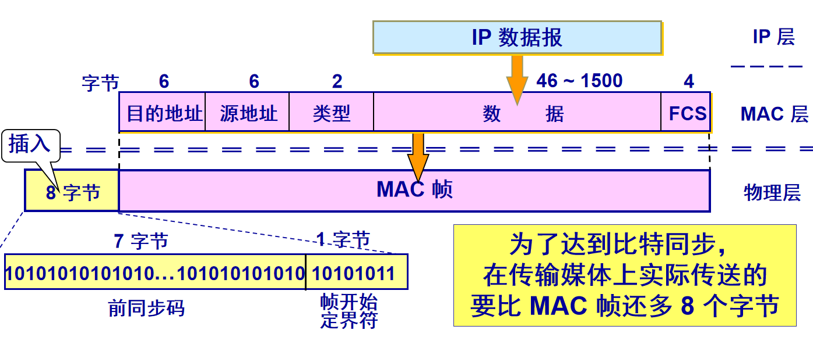

扩展的以太网

在物理层扩展以太网

使用集线器扩展，优点：使原来属于不同碰撞域的以太网上的计算机能够进行跨碰撞域的通信。

缺点：碰撞域增大了，但总的吞吐量并未提高；需要相同速率的以太网技术

在数据链路层扩展以太网

- 网桥工作在数据链路层。

它根据 MAC 帧的目的地址对收到的帧进行转发和过滤。

当网桥收到一个帧时，并不是向所有的接口转发此帧，而是先检查此帧的目的 MAC 地址，然后再确定将该帧转发到哪一个接口，或把它丢弃。

- 以太网交换机

以太网交换机实质上就是一个多接口的网桥。二层交换技术

以太网交换机具有并行性，

**共享广播域，独立的碰撞域**

以太网交换机是一种即插即用设备，其内部的帧

**交换表**

（又称为地址表）是通过自学习算法自动地逐渐建立起来的。

以太网交换机使用了专用的交换结构芯片，用硬件转发，其转发速率要比使用软件转发的网桥快很多。

据说还有三层转发技术

**生成树协议 STP**

其要点是：不改变网络的实际拓扑，但在

**逻辑上**

则

**切断某些链路**

，使得从一台主机到所有其他主机的路径是无环路的树状结构，从而

**消除了兜圈子**

现象。

虚拟局域网VLAN

虚拟局域网其实只是局域网给用户提供的一种服务，而并不是一种新型局域网。

虚拟局域网协议允许在以太网的帧格式中插入一个4字节的标识符，称为

** VLAN 标记 **

(tag)，用来指明发送该帧的计算机属于哪一个虚拟局域网。

插入 VLAN 标记得出的帧称为

** 802.1Q 帧**

 或 带

**标记的以太网帧**

。

数据链路层的有那三个基本问题？为什么都必须加以解决？

数据链路层的三个基本问题:封装成帧、透明传输、差错检测。

⑴封装成帧就是在一段数据前后分别添加首部和尾部。接收端以便从收到的比特流中识别帧的开始与结束，帧定界是分组交换的必然要求；

⑵ 透明传输避免消息符号与帧定界符号相混淆；

⑶差错检测防止差错的无效数据帧，浪费网络资源

第4章 网络层

4.1 网络层提供的两种服务

- 使用面向连接的通信方式

通信之前先建立

**虚电路**

 (Virtual Circuit)，以保证双方通信所需的一切网络资源。 

虚电路表示一条

**逻辑上的连接**

，分组都沿着这条逻辑连接

**按照存储转发方式传送，**

而并不是真正建立了一条物理连接。

- 网络提供数据报服务

网络层向上只提供简单灵活的、无连接的、尽最大努力交付的数据报服务。

| **对比的方面**                 | **虚电路服务**                                     | **数据报服务**                                         |
| ------------------------------ | -------------------------------------------------- | ------------------------------------------------------ |
| **思路**                       | **可靠通信应当由网络来保证**                       | **可靠通信应当由用户主机来保证**                       |
| **连接的建立**                 | **必须有**                                         | **不需要**                                             |
| **终点地址**                   | **仅在连接建立阶段使用，每个分组使用短的虚电路号** | **每个分组都有终点的完整地址**                         |
| **分组的转发路径**             | **属于同一条虚电路的分组均按照同一路由进行转发**   | **每个分组独立选择路由进行转发**                       |
| **当结点出故障时**             | **所有通过出故障的结点的虚电路均不能工作**         | **出故障的结点可能会丢失分组，一些路由可能会发生变化** |
| **分组的顺序**                 | **总是按发送顺序到达终点**                         | **到达终点时不一定按发送顺序**                         |
| **端到端的差错处理和流量控制** | **可以由网络负责，也可以由用户主机负责**           | **由用户主机负责**                                     |

4.2 网际协议 IP

网际协议 IP 是 TCP/IP 体系中两个最主要的协议之一。

与 IP 协议配套使用的还有三个协议：

地址解析协议 

**ARP**

(Address Resolution Protocol)

网际控制报文协议

** ICMP**

(Internet Control Message Protocol)

网际组管理协议 

**IGMP**

(Internet Group Management Protocol)

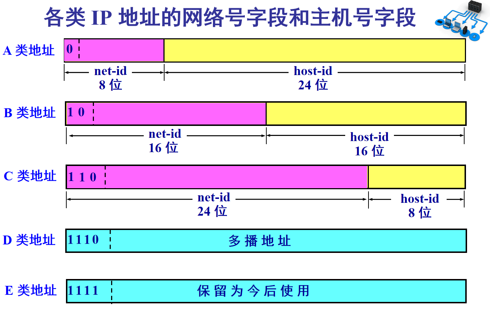

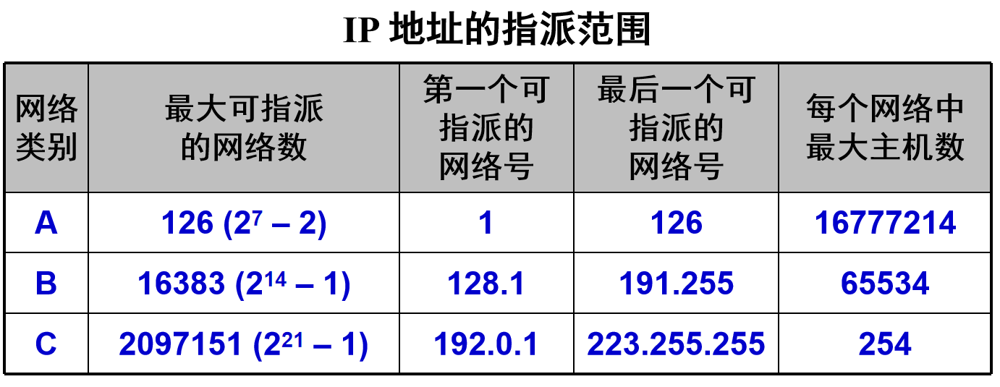

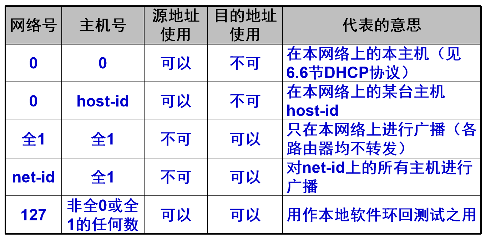

在同一个局域网上的主机或路由器的IP 地址中的网络号必须是一样的。

4.2.3  IP 地址与硬件地址

从层次的角度看，

硬件地址（或物理地址）是数据链路层和物理层使用的地址。

IP 地址是网络层和以上各层使用的地址，是一种逻辑地址（称 IP 地址是逻辑地址是因为 IP 地址是用软件实现的）。

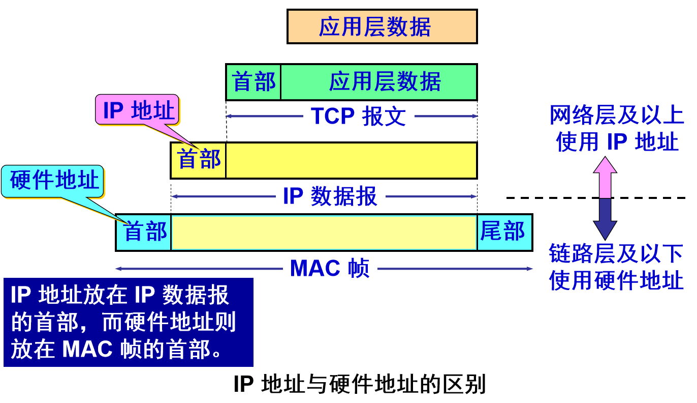

地址解析协议 ARP 的作用

ARP 作用：从网络层使用的 IP 地址，解析出在数据链路层使用的硬件地址。

ARP请求分组：包含发送方硬件地址 / 发送方 IP 地址 / 目标方硬件地址(未知时填 0) / 目标方 IP 地址。

本地广播 ARP 请求（路由器不转发ARP请求）。

ARP 响应分组：包含发送方硬件地址 / 发送方 IP地址 / 目标方硬件地址 / 目标方 IP 地址。

ARP 分组封装在物理网络的帧中传输。

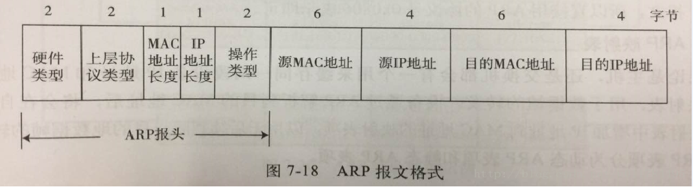

IP 地址中的网络号必须是一样的。

RP 是解决同一个局域网上的主机或路由器的 IP 地址和硬件地址的映射问题。

从 IP 地址到硬件地址的解析是自动进行的，主机的用户对这种地址解析过程是不知道的。

IP 数据报的格式

一个 IP 数据报由首部和数据两部分组成。

首部的前一部分是固定长度，共 20 字节，是所有 IP 数据报必须具有的。

在首部的固定部分的后面是一些可选字段，其长度是可变的。

片偏移—— 占13 位，指出：较长的分组在分片后，某片在原分组中的相对位置。片偏移以 8 个字节为偏移单位。

最大数据部分为1400字节，带上首部20字节

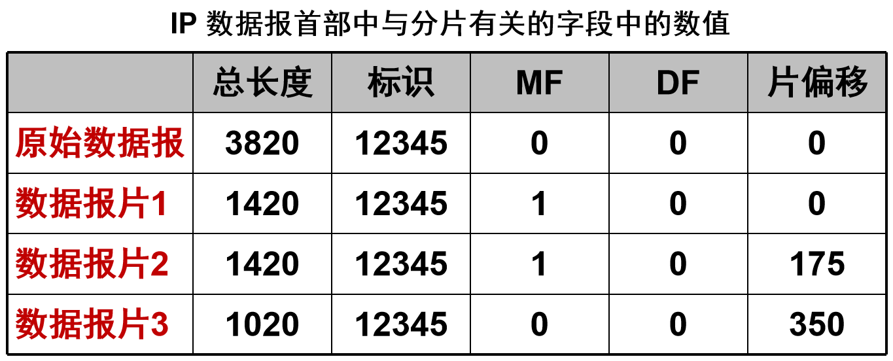

MF表示more fragment即还有分片，DF表示don't fragment即没有分片。

MF=1还有分片MF=0没有分片；DF=0允许分片，DF=1不允许分片

路由表

路由表没有给分组指明到某个网络的完整路径。

路由表指出，到某个网络应当先到某个路由器（即下一跳路由器）。

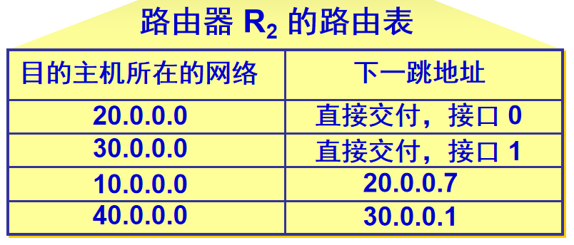

4.3 划分子网和构造超网

划分子网纯属一个单位内部的事情。单位对外仍然表现为没有划分子网的网络。

从主机号借用若干个位作为子网号 subnet-id，而主机号 host-id 也就相应减少了若干个位。

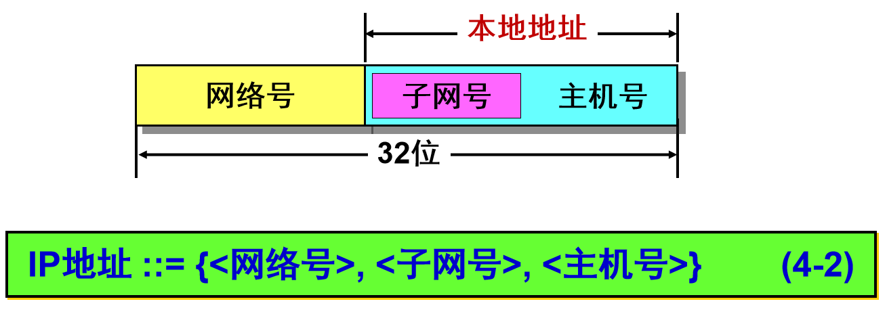

有

**固定长度子网**

和

**变长子网**

两种子网划分方法。

在采用固定长度子网时，所划分的所有子网的子网掩码都是相同的。

**划分子网增加了灵活性，但却减少了能够连接在网络上的主机总数。**

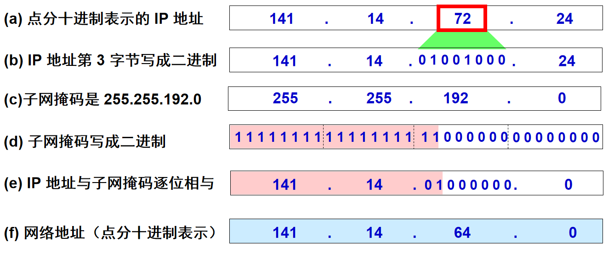

4.4 网际控制报文协议 ICMP

为了更有效地转发 IP 数据报和提高交付成功的机会，在网际层使用了网际控制报文协议 ICMP (Internet Control Message Protocol)。

ICMP 是互联网的标准协议。

**ICMP 允许主机或路由器报告差错情况和提供有关异常情况的报告。**

但 ICMP 不是高层协议（看起来好像是高层协议，因为

** ICMP 报文是装在 IP 数据报中**

，作为其中的

**数据部分**

），而是 IP 层  的协议。

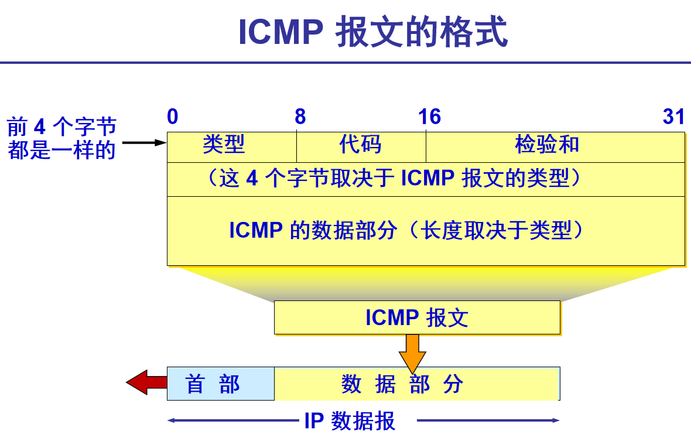

ICMP 差错报告报文共有 4 种

- 终点不可达 
- 时间超过 
- 参数问题 
- 改变路由（重定向）(Redirect)

ICMP的应用举例

- PING 用来测试两个主机之间的连通性。

PING 使用了 ICMP 回送请求与回送回答报文。

PING 是应用层直接使用网络层 ICMP 的例子，它没有通过运输层的 TCP 或UDP。

- Traceroute 的应用举例

在 Windows 操作系统中这个命令是 tracert。

用来跟踪一个分组从源点到终点的路径。

它利用 IP 数据报中的 TTL 字段和 ICMP 时间超过差错报告报文实现对从源点到终点的路径的跟踪。

4.5 互联网的路由选择协议

4.5.1  有关路由选择协议的几个基本概念

从路由算法的自适应性考虑

- 静态路由选择策略——即非自适应路由选择，其特点是简单和开销较小，但不能及时适应网络状态的变化。 
- 动态路由选择策略——即自适应路由选择，其特点是能较好地适应网络状态的变化，但实现起来较为复杂，开销也比较大。

分层次的路由选择协议

内部网关协议 IGP (Interior Gateway Protocol)  

在一个自治系统内部使用的路由选择协议。

目前这类路由选择协议使用得最多，如 RIP 和 OSPF 协议。

外部网关协议 EGP (External Gateway Protocol) 

若源站和目的站处在不同的自治系统中，当数据报传到一个自治系统的边界时，就需要使用一种协议将路由选择信息传递到另一个自治系统中。这样的协议就是外部网关协议 EGP。

在外部网关协议中目前使用最多的是 BGP-4。

AS指的是单一技术管理下的一组

**路由器**

AS之间采用的路由选择协议为

**外部网关协议**

4.5.2  内部网关协议 RIP

- 路由信息协议 RIP (Routing Information Protocol) 是内部网关协议 IGP 中最先得到广泛使用的协议。
- RIP 是一种分布式的、基于距离向量的路由选择协议。
- RIP 协议要求网络中的每一个路由器都要维护从它自己到其他每一个目的网络的距离记录。

RIP 允许一条路径最多只能包含 

**15 个**

路由器。

**“距离”的最大值为 16 时即相当于不可达**

。可见 RIP 只适用于小型互联网。

RIP 不能在两个网络之间同时使用多条路由。

**RIP 协议的三个特点**

(1) 仅和相邻路由器交换信息。 

(2) 交换的信息是当前本路由器所知道的全部信息，即自己的路由表。 

(3) 按固定的时间间隔交换路由信息，例如，每隔 30 秒。当网络拓扑发生变化时，路由器也及时向相邻路由器通告拓扑变化后的路由信息。

**RIP2 协议的报文格式**

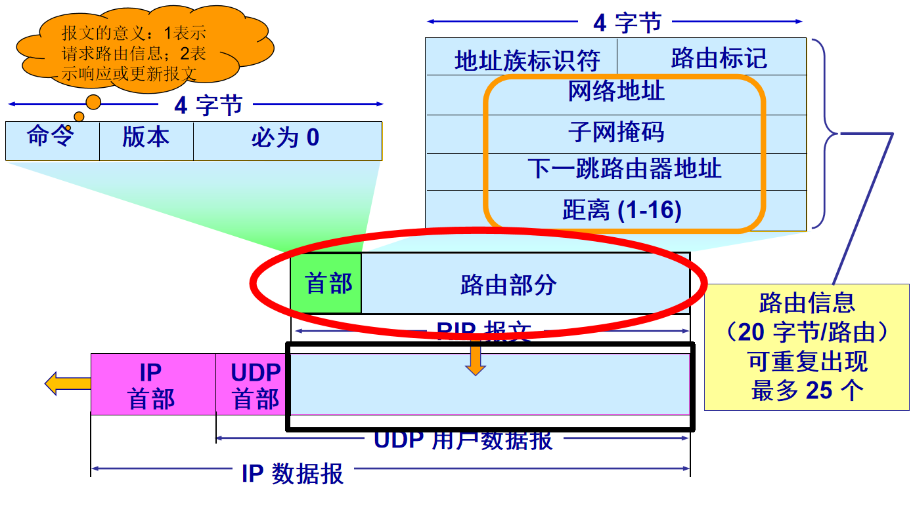

RIP协议特点：好消息传播得快，坏消息传播得慢。

RIP存在的一个问题：当网络出现故障时，要经过比较长的时间 (例如数分钟) 才能将此信息传送到所有的路由器。

4.5.3  内部网关协议 OSPF

“最短路径优先”是因为使用了 Dijkstra 提出的最短路径算法 SPF

采用分布式的 

**链路状态**

 协议 (link state protocol)。

向本自治系统中所有路由器发送信息，这里使用的方法是洪泛法。

发送的信息就是与本路由器相邻的所有路由器的链路状态，但这只是路由器所知道的部分信息。

只有当链路状态

**发生变化**

时，路由器才用

**洪泛法**

向所有路由器发送此信息。

**OSPF 的区域 (area)**

为了使 OSPF 能够用于规模很大的网络，OSPF 将一个自治系统再划分为若干个更小的范围，叫作区域。

每一个区域都有一个 32 位的区域标识符（用点分十进制表示）。

**划分区域**

在一个区域内部的路由器只知道本区域的完整网络拓扑，而不知道其他区域的网络拓扑的情况。

OSPF 使用

**层次结构的区域划分**

。在上层的区域叫作

**主干区域 (backbone area)**

。

**OSPF 直接用 IP 数据报传送**

OSPF 不用 UDP 而是直接用 IP 数据报传送。

OSPF 构成的数据报很短。这样做可减少路由信息的通信量。

数据报很短的另一好处是可以不必将长的数据报分片传送。

**OSPF 分组**

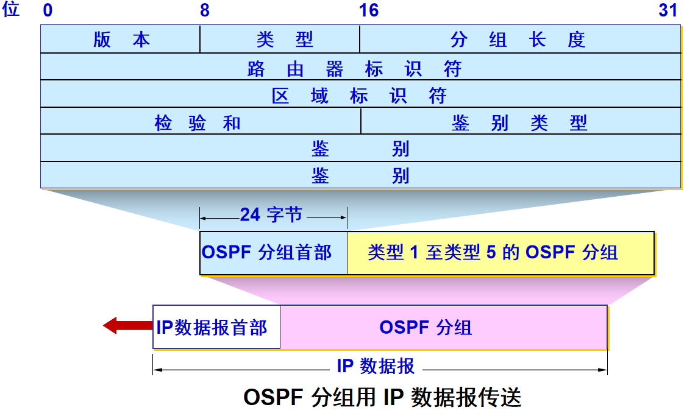

4.5.4  外部网关协议 BGP

BGP 是

**不同自治系统的路由器之间**

交换路由信息的协议。

边界网关协议 BGP 只能是力求寻找一条能够到达目的网络且

**比较好的路由**

（不能兜圈子），而

**并非要寻找一条最佳路由。**

**BGP 发言人**

一个 BGP 发言人与其他自治系统中的 BGP 发言人要交换路由信息，就要先建立

** TCP 连接**

，然后在此连接上交换 BGP 报文以建立 BGP 

**会话**

(session)，利用 BGP 会话交换路由信息。

使用 TCP 连接能提供可靠的服务，也简化了路由选择协议。

使用 TCP 连接交换路由信息的两个 BGP 发言人，彼此成为对方的邻站(neighbor)或对等站(peer)

第5章 运输层

运输层协议概述

从运输层的角度看，通信的真正端点并不是主机而是主机中的进程。也就是说，

端到端的通信是**应用进程之间的通信**。

- 用户数据报协议 UDP (User Datagram Protocol)**一种无连接协议**
	- 提供无连接服务。
	- 在传送数据之前不需要先建立连接。
	- 传送的协议数据单位是 UDP 报文或用户数据报。
	- 对方的运输层在收到 UDP 报文后，不需要给出任何确认。
	- 虽然 UDP 不提供可靠交付，但在某些情况下 UDP 是一种最有效的工作方式。
- 传输控制协议 TCP (Transmission Control Protocol)**一种面向连接的协议**
	- 提供面向连接的服务。
	- 传送的协议数据单位是 TCP 报文段 (segment)。
	- TCP 不提供广播或多播服务。
	- 由于 TCP 要提供可靠的、面向连接的运输服务，因此不可避免地增加了许多的开销。

运输层的端口

端口用一个 **16 位端口号**进行标志。

端口号只具有**本地意义**，即端口号只是为了标志**本计算机应用层中的各进程**。在互联网中，不同计算机的相同端口号是没有联系的。

熟知端口，数值一般为 0~1023。

TFTP 69（UDP）传输文件的简单协议

DNS （TCP/UDP）53

SMTP（TCP）25 电子邮件传输的协议

FTP（TCP）20/21

HTTP（TCP）80

HTTPS（TCP）443

登记端口号，数值为 1024~49151，为没有熟知端口号的应用程序使用的。

又称为短暂端口号，数值为 49152~65535，留给客户进程选择暂时使用。

用户数据报协议UDP

UDP 只在 IP 的数据报服务之上增加了很少一点的功能：

- 复用和分用的功能
- 差错检测的功能

UDP 是面向报文的。UDP 对应用层交下来的报文，既不合并，也不拆分，而是保留这些报文的边界。UDP 一次交付一个完整的报文。最大512字节

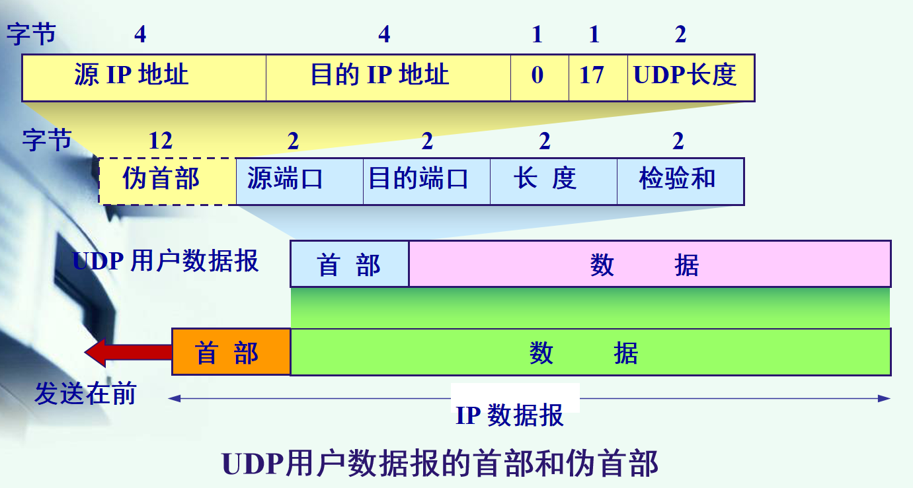

传输控制协议TCP

TCP 是面向连接的运输层协议。

每一条 TCP 连接只能有两个端点 (endpoint)，每一条 TCP 连接只能是点对点的（一对一）。 

TCP 提供可靠交付的服务。

TCP 提供全双工通信。

面向字节流

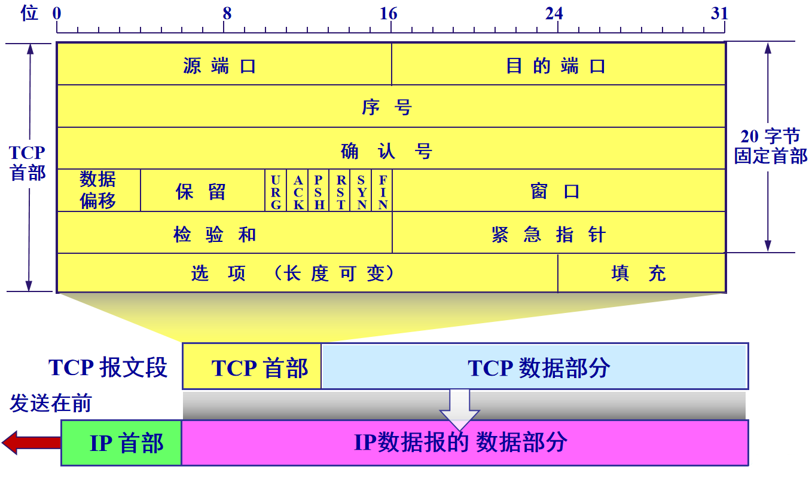

5.5.1 TCP连接的建立

TCP 建立连接的过程叫做握手。

握手需要在客户和服务器之间交换三个 TCP 报文段。称之为三报文握手。

采用三报文握手主要是为了防止已失效的连接请求报文段突然又传送到了，因而产生错误。

5.5.2 TCP连接的释放

数据传输结束后，通信的双方都可释放连接。

TCP 连接释放过程是四报文握手。

5.6.2  以字节为单位的滑动窗口协议

**流量控制**

 (flow control) 就是让发送方的发送速率不要太快，既要让接收方来得及接收，也不要使网络发生拥塞。

利用

**滑动窗口机制**

可以很方便地在 TCP 连接上实现流量控制。

拥塞控制与流量控制的区别

**拥塞控制**

就是防止过多的数据注入到网络中，使网络中的路由器或链路不致过载。

**拥塞控制**

是一个全局性的过程，涉及到所有的主机、所有的路由器，以及与降低网络传输性能有关的所有因素。

**流量控制**

往往指点对点通信量的控制，是个端到端的问题（接收端控制发送端）。

**流量控制**

所要做的就是抑制发送端发送数据的速率，以便使接收端来得及接收。

TCP拥塞控制算法

- 慢开始 (slow-start)
- 拥塞避免 (congestion avoidance)
- 快重传 (fast retransmit)
- 快恢复 (fast recovery)

第6章 应用层

6.1 域名系统DNS

- 主域名服务器：负责维护一个区域所有域名信息，为特定域名的所有信息的权威来源，可以修改信息。
- 辅助域名服务器：当主域名服务器出现故障，关机或负载过重等情况，辅助域名服务器作为备份服务器来提供域名解析服务，辅助域名服务器是从另一台远程域名服务器下载的所有域名信息，域名信息不具有修改权限
- 缓存域名服务器：当从远程域名服务器获得域名解析信息后，将其缓存到高速缓存中，当下次需要请求相同的域名解析时，直接从本地缓存中读取，缓存域名信息不具有权威性
- 转发域名服务器：转发域名服务器用来请求不在本地域名服务器上的信息，当收到域名请求服务时，现在本地缓存中查取，如果查询不到。即依次向指定的域名服务器发出请求，直到查到所需信息返回结果。否则，返回无法映射的信息。

顶级域名

.com（公司和企业）

.net（网络服务机构）

.org（非赢利性组织）

.edu（美国专用的教育机构）

.gov（美国专用的政府部门）

.mil（美国专用的军事部门）

.int（国际组织）

6.2 文件传送协议FTP

FTP屏蔽了各计算机系统的细节，因而适合于在异构网络中任意计算机之间传送文件。

当客户进程向服务器进程发出**建立连接**请求时，要寻找连接服务器进程的**熟知端口（21）**
，同时还要告诉服务器进程自己的另一个端口号码，用于建立数据传送连接。接着，服务器进程用自己传送数据的**熟知端口（20）** 与客户进程所提供的端口号码建立**数据传送**连接。

TFTP简单文件传送协议

端口号UDP69

6.3 远程终端协议TELNET

熟知端口23

6.4 万维网WWW

使用统一资源定位符URL（Uniform Resource Locator）来标志万维网上的各种文档。

使每一个文档在整个互联网的范围内具有唯一的标识符URL。

6.5 电子邮件

电子邮件概述

发送邮件的协议：SMTP

读取邮件的协议：POP3和IMAP（网际报文存取协议）

SMTP熟知端口号码为25

POP3熟知端口号码为110

IMAP熟知端口号码为143

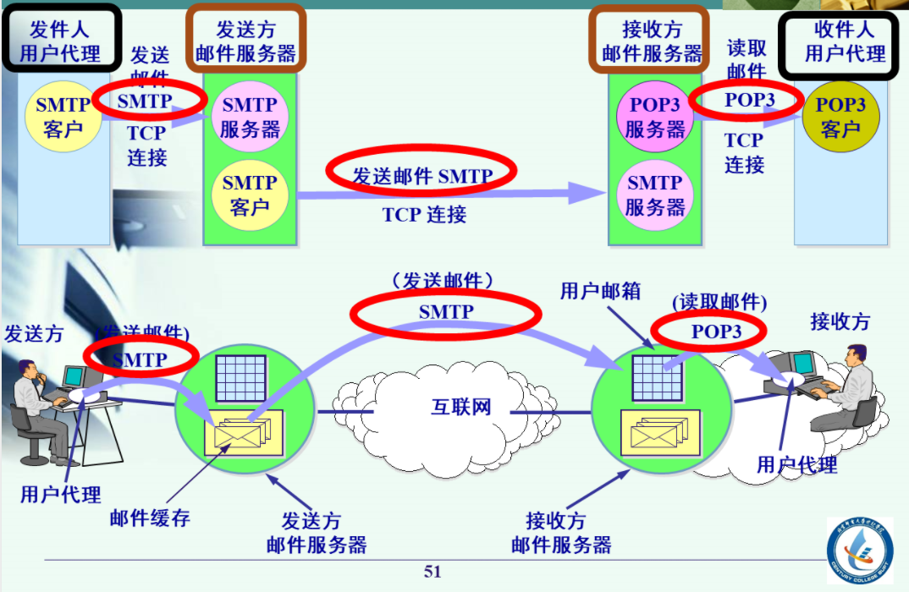

6.6 动态主机配置协议DHCP

客户UDP端口68 服务器UDP端口67

