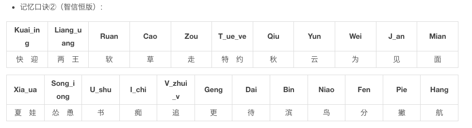

## 一、双拼方案：  
使用两个字母对汉字进行编码的方案，第一个字母表示声母，第二字母表示韵母，没有声母时用零声母代替  
单字母声母韵母键位不变，双字母声母和多字母韵母位置见“双拼键位图”

## 二、零声母方案：  
指全拼中无声母的韵母音节在双拼中的处理方案，用来充当其声母的字母即零声母

1.  本方案以韵母首字母为零声母，即把韵母的首字母当作声母  
    单字母韵母，零声母 + 韵母所在键，如： 啊＝aa 哦=oo 额=ee  
    双字母韵母，零声母 + 韵母末字母，如： 爱＝ai 恩=en 欧=ou  
    三字母韵母，零声母 + 韵母所在键，如： 昂＝ah
2.  简单说：**双字母音节保持全拼方式，一三字母音节为首字母加韵母所在键**

## 三、双拼键位图

-   学习过程：一小时记忆键位，一周习惯双拼节奏，一月恢复全拼时速度
-   请在各拼音输入法的设置中选择本方案使用
---
记忆口诀
